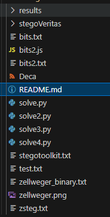
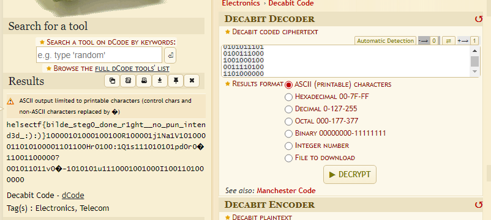

# zellweger

Jeg brukte DALL-E til å generere et bilde med følgende beskrivelse:

ones and zeros as electrical pulses over a set of power lines

Jeg syntes det var en passende beskrivelse siden jeg har skjult et tier-bit enkodet flagg i bildet.

Husk! Det er viktig å ha en god start puls i hvert ledd av den minst betydninsgfulle biten i diagrammet.

[⬇️ zellweger.png](zellweger.png)

# Writeup

The name is `zellweger`, it talks about pulses and `10th bit` which seems to be a reference to the `decabit` unit after googling `zellweger 10 bit decode`. The `Zellweger` is a electrical instrument which are connected to decabit . [This site](https://blog.gcwizard.net/manual/en/decabit-science-and-technology/01-what-is-decabit/) talks about it and the last thing I notice is `minst betydninsgfulle biten` which is `least significant bit` in norwegian. 

This one I used a lot of time on and was the last one in my list. I used [aperisolve](https://www.aperisolve.com/76319bd94ea231674e7ed8f00cf72ac2) which gave me some interesting bits on the first color channels. But I ignored it as noise. (Big mistake)

I talked to a friend on this one as well and he said he found some base64 data which pointed to decabit. So I thought less on that as I already knew that.

Then I had to ask for a better hint. Someone told me to look more around where I found out about the `decabit`. I was then looking around on the `gcwizard` page, on the wikipedia page and found... nothing! After a few hours I finally found out that I needed to find out where the `decabit` was mentioned in the file. The secret base64 data.

I used [stego-toolkit](https://github.com/DominicBreuker/stego-toolkit) which gave me a big file [stegotoolkit.txt](./stegotoolkit.txt) searching for data in that I finally found a base64 string on line [572](./stegotoolkit.txt#L572).

```
b1,bgr,msb,XY       .. text: "==AdpJWYjVGRvk2apd3LnJ3buEWakVGcptWa35SZk9yL6MHc0RHa"
```

This reversed then decoded was the wikipedia page. But my second big hint was to look where i found this. And accordinng to the tool it was in the `most significant bit` of the `blue 1` channel. 

After a few hours of attempts I get a messy folder.



Then all of the sudden I got the LSB of every color of every bit and it got a bit (no phun intended) more interesting. 

I can now find decabit for the letter `h` (1101100100), then `e` (0100111010) by searching in the data I got. It is always prepended by a 1 so this is the `start bit` mentioned in the description.

So now I try to automate it in [solve.py](./solve.py) and get the flag.



# Flag 

```
helsectf{bilde_steg0_done_r1ght__no_pun_intend3d_:):)}
```