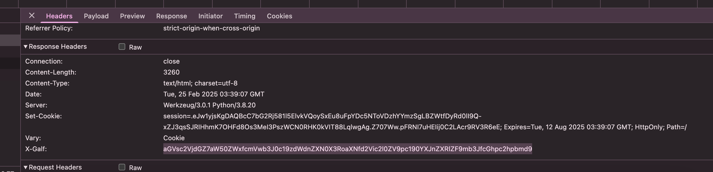

# hackproof banking

HackProof Banking Corperation follows cyber security's best practices; enforced MFA (multifactor authentication) on all users. They use a time-based one-time password (TOTP) - a common and well known MFA method.

Visit our bank, and see if you find the publicly disclosed flag.

PS: This site is also used in other phishing challenges.

[🔗 https://helsectf2025-42694257c6fdb3976dd6-hackproof-banking.chals.io/](https://helsectf2025-42694257c6fdb3976dd6-hackproof-banking.chals.io/)

# Writeup

Source code of website shows a hidden url (/register), visiting that gives just a `Registration is disabled` message. HTML Source code shows nothing, css nothing, robots.txt nothing. The csrf token is nothing.

Fuzzing shows:

```
/console                 [Status: 200, Size: 1563, Words: 330, Lines: 46, Duration: 120ms]
/login                   [Status: 200, Size: 3260, Words: 476, Lines: 83, Duration: 116ms]
/logout                  [Status: 302, Size: 229, Words: 18, Lines: 6, Duration: 140ms]
/overview                [Status: 302, Size: 233, Words: 18, Lines: 6, Duration: 121ms]
/register                [Status: 302, Size: 189, Words: 18, Lines: 6, Duration: 107ms]
```

Nothing works. I did the 3 other web challenges before going back to this one. And then it dawned on me, maybe just looking at the headers..

"X-Galf"... Backwards `flag`..



Simple base64 decode on this gives the flag.

# Flag

```
helsectf{intel_reports_suggest_this_website_is_targeted_for_phishing}
```