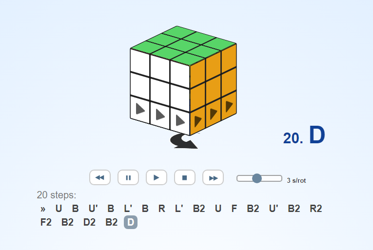
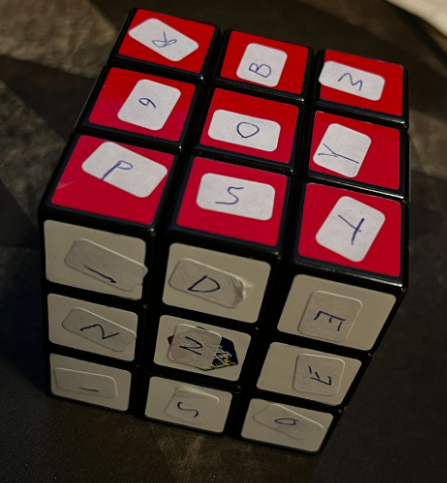

# Scrambled

Over natten har det vært store utfordringer knyttet til en av maskinene i verkstedet. En serie feilproduserte leker har kommet på rullende bånd. Vi prøver å finne ut hva som har skjedd. Graver du ned i det her?

-Mellomleder

[📎Bilde](oedelagte_leker_fix.png)

# Writeup

First attempt was to write the numbers on a whiteboard marker on an actual cube. Then input it to [this website](https://rubikscu.be/solver/?cube=0551236134633344526463112214642624132314564556325551261) to get the solution.



Ended up with a cube smeared with whiteboard marker, and a solution that really lacked a lot of letters.

Second attempt was to write the numbers on a piece of paper taped to it. But when solved I could not for the life of me find any sense. So I guessed I had put them on wrong. All I found was PST but the RBMGOY made no sense at this time.



So I started coding. I started by making a 3d array of the cube with all faces numbered and named. Then I started making one by one face rotate. After a while I had a program which could do all the rotations I needed.

I then changed the 3d array to contain the letters from the challenge: 

```javascript
rubicsCube = [
  [["_ ", "_ ", ": "], ["_ ", "O ", "S "], ["U ", "S ", "M "]],
  [["L ", "D ", "P "], ["B ", "T ", "L "], ["_ ", "E ", "Ø "]],
  [["R ", "D ", "T "], ["S ", "N ", "? "], ["P ", "E ", "P "]],
  [["E ", "L ", "{ "], ["L ", "S ", "E "], ["W ", ") ", "O "]],
  [["_ ", "K ", "} "], ["U ", "E ", "B "], ["I ", "G ", "L "]],
  [["U ", "L ", "E "], ["S ", "E ", "N "], ["_ ", "Y ", "R "]],
];
```

And then I run [solve.js](solve.js) which printed out this:

```
           R  B  W
           G  O  Y
           P  S  T
  {  L  Ø  _  D  E  M  _  P
  S  T  E  N  N  E  U  S  L
  _  D  U  _  S  O  E  S  P
           I  L  L
           _  E  L
           L  E  R
           _  K  U
           B  E  ?
           :  )  }
```

From that I could read the flag.

```
RBWGOYPST{LØSTE_DU_DENNE_SOM_PUSLESPILL_ELLER_KUBE?:)}
```

Removed the 6 first letters as they were just the colors of the cube.

Now the self reflection part. I had to read one by one face and then rotate it to the correct next face. Then the cube I fixed earlier would have made sense. Aarrgh... Oh well, was fun making this script for it.

# Flag

```
PST{LØSTE_DU_DENNE_SOM_PUSLESPILL_ELLER_KUBE?:)}
```

PST{løste_du_denne_som_puslespill_eller_kube?:)}
