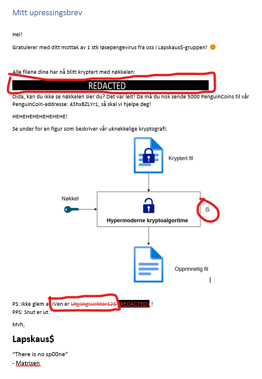
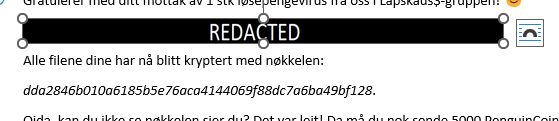
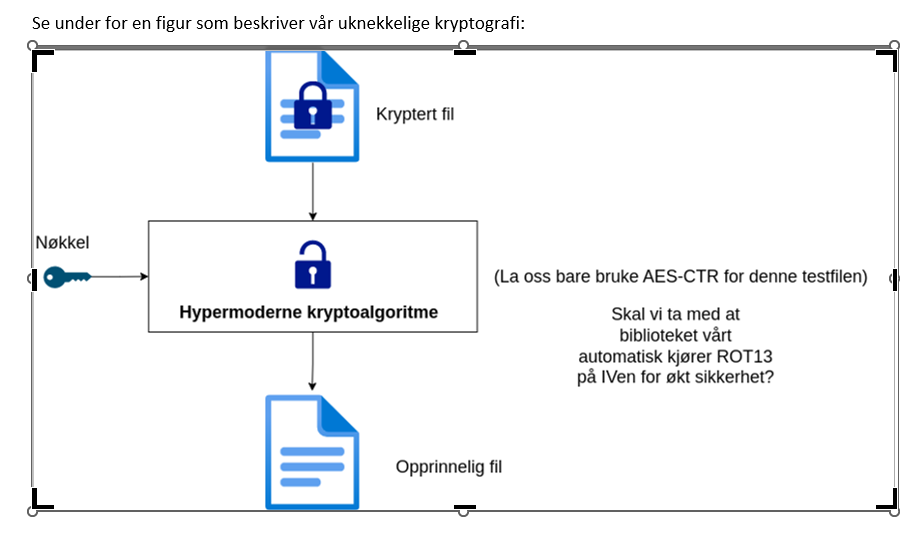
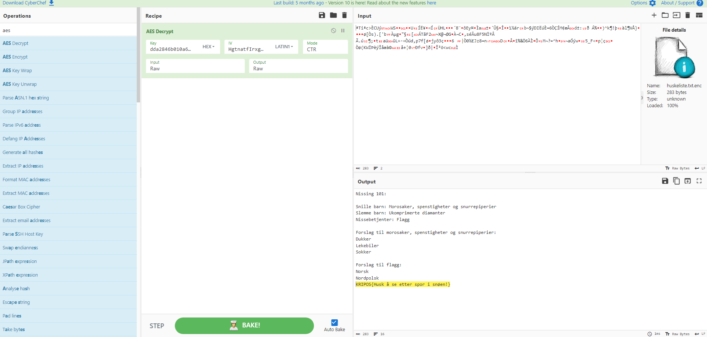

# 📃Redacted

Det er krise! Filene på alvemaskinene har blitt kryptert, og vi har ingen backups tilgjengelig!

På nissens skrivebord fant vi det vedlagte brevet, sammen med en kryptert fil.

Det er ubeskrivelig viktig at vi får åpnet denne filen igjen umiddelbart, da Jule NISSEN ikke klarer å huske innholdet!

- Mellomleder

📎 [Mitt utpressingsbrev.docx](./Mitt%20upressingsbrev.docx)
📎 [huskeliste.txt.enc](./huskeliste.txt.enc)

# Writeup

Looking at the document it talks about a cryptovirus. The file has been encrypted and the key is redacted. Below you see that there is a image desribing the encryption process and information about the IV. So we have a key, iv and encryption method.



Opening in word we can easily move the redacted text and get the key.



So by doing this we both have the key and IV they have forgotten to redact. The image of the encryption process also hints that there are something more. Changing the crop on this roughly gave me the full image:



So gathered data so far:

```
key = dda2846b010a6185b5e76aca4144069f88dc7a6ba49bf128
IV is run through rot13 before use
iv = UtgangsVektor123 (rot13: HgtnatfIrxgbe123)
method = AES-CTR
```

So I inserted all data to [CyberChef](<https://gchq.github.io/CyberChef/#recipe=AES_Decrypt(%7B'option':'Hex','string':'dda2846b010a6185b5e76aca4144069f88dc7a6ba49bf128'%7D,%7B'option':'Latin1','string':'HgtnatfIrxgbe123'%7D,'CTR','Raw','Raw',%7B'option':'Hex','string':''%7D,%7B'option':'Hex','string':''%7D)&input=qlRpqmM%2ByENV/QMGV1OEnBGZf1Uezculf6vNDdxITIN/jbQ4qJn0RXmkrcxhELGStNunjs6Vl%2By94XIN8n4k/URJy/rIPTbSx81NoubCFPOxOh/woMEli4spXmu2If4e4Gy2VsV9iJ2UgPhb0nMpLlsnYgzAtWeeIqceWwbBVONGMhV%2BWECs2EeYwKxDnyxz6cJ1OEY1Ts%2B6wgrDLvoPtjuYdAhh/BT7TLu3q9L6ZCxwN2Zb%2BIpqefQz552AjTYgDHzSML2jSno4PW4LGBREDYjClO4lJtY2wMx/1BxNrD89XmiZFqxh0/13jw41X0arjHCm5xKE0vgoS1fP3uj9zuXm4KkVCOUrpjAL0GZ2hl3wfJPOsvY8d2MQzA>) to do this



# Flag

```
KRIPOS{Husk å se etter spor i snøen!}
```
