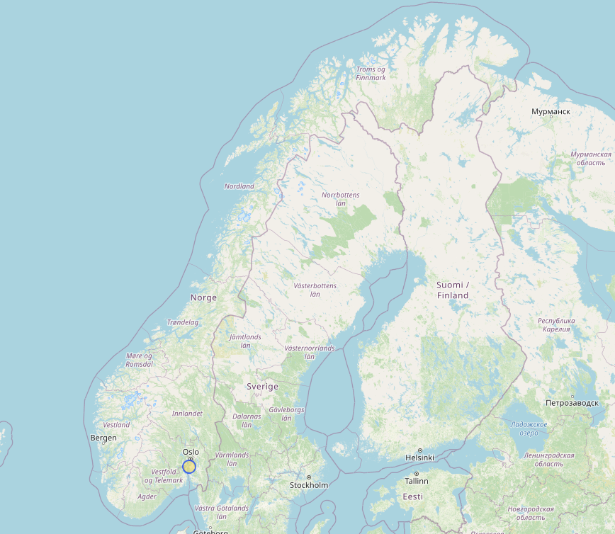
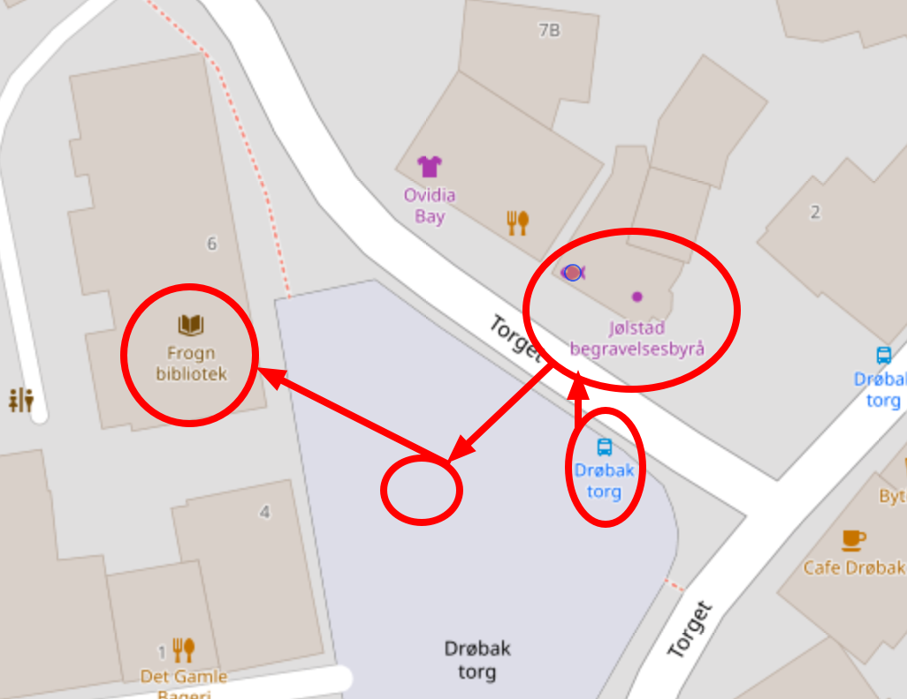
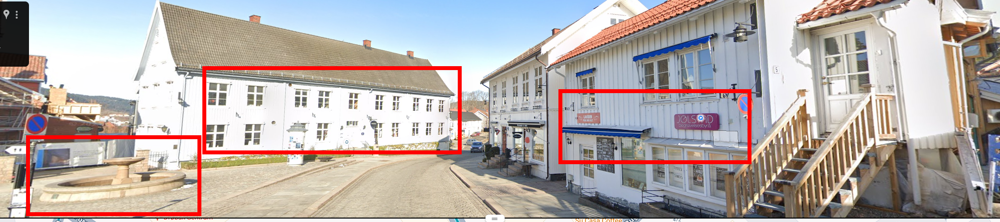

# Muldvarpjakt 

Gjennom temmelig hemmelige innhentingsmetoder har vi fanget opp en melding om et nært forestående møte på Fastlands-Norge mellom en mistenkt kildefører som jobber for sydpolare tjenester og et ukjent objekt vi mistenker kan være en muldvarp.

For at våre spaningsalver skal settes i stand til å observere møtet og identifisere det ukjente objektet må vi vite hvor vi skal sende våre alver.

Vi prøvde å spørre OSINT-alvene våre, men de var travelt opptatt med å saumfare sosiale medier etter snille og slemme barn. De mumlet noe om at vi kunne fikse det selv med “turbo overgang”.

Kan du ut fra meldingen finne ut hvor de skal møtes?

```
Ta bussen og gå av på holdeplassen rett ved begravelsesbyrået som ligger inntil en sjømatbutikk. Jeg vil stå klar ved fontenen noen titalls meter fra bussholdeplassen. Når du har kommet frem til fontenen, vil vi sammen gå til det nærliggende biblioteket som ligger under 50 meter fra fontenen og gjennomfører overføringen.
```

Svar meg med navnet på møtestedet og på formen PST{BERGEN LUFTHAVN}

\- Tastefinger

# Writeup

Trying a lot to figure out what the "turbo overgang" is, googking it did nothing. But I figured out it should be alternative words so I went with `overpass` but could not find anything to change `turbo` with.. After a while I asked for a tip from a collegue. And `turbo` most likely should be unaltered. 

That gave me `https://overpass-turbo.eu/` which is a query service for Open Street Map.

I tried a whole lof of queries and after a while I figured out to take it with baby steps.

```
[out:json];
area["ISO3166-1"="NO"]->.searchArea;
(
  node["shop"="funeral_directors"](area.searchArea);
)->.funeral;

(.funural;);

out body;
```

Then I added seafood within 20 meters of the funural_directors and I get 1 hit:

```
[out:json];
area["ISO3166-1"="NO"]->.searchArea;
(
  node["shop"="funeral_directors"](area.searchArea);
)->.funeral;


(
  node(around.funeral:20)["shop"="seafood"];
)->.seafood;

(.seafood;);

out body;
```




Zooming in there I found all of the other tings:



I know the map does not show the fontain, but it is there according to street view:



# Flag

```
PST{FROGN BIBLIOTEK}
```

# Tips for future me:

[OSM Map Features](https://wiki.openstreetmap.org/wiki/Map_features)

```
area["ISO3166-1"="NO"]->.norway;
node(area.norway)[shop=funeral_directors];
node(around:30)[amenity=fountain];
node(around:50)[amenity=library];
out;
```