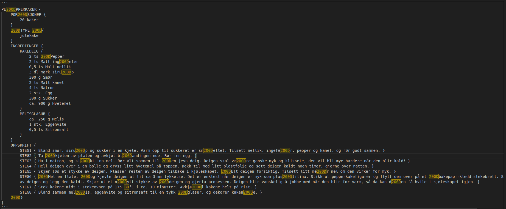

# 🍪 KAKER-kontroll

I en standard KAKER-kontroll (Kontroll Av Kommuniké med Eksport-Restriksjoner) har det blitt tatt en kopi av dette dokumentet. Vi syns det er snodig at akkurat denne personen har hatt med seg dokumentet siden personen har hatt anti-jul-holdninger tidligere, og vi vil derfor at du tar en nærmere kikk for å se etter uhumskheter.

\- Tastefinger

```
PE‍PPERKAKER {
    POR‍SJONER {
        20 kaker
    }
    ‍TYPE ‍{
        julekake
    }
    INGREDIENSER {
        KAKEDEIG {
            2 ts ‍Pepper
            2 ts Malt ing‍efær
            0,5 ts Malt nellik
            3 dl Mørk siru‍p
            300 g Smør
            2 ts Malt kanel
            4 ts Natron
            2 stk. Egg
            300 g Sukker
            ca. 900 g Hvetemel
        }
        MELISGLASUR {
            ca. 250 g Melis
            1 stk. Eggehvite
            0,5 ts Sitronsaft
        }
    }
    OPPSKRIFT {
        STEG1 { Bland smør, siru‍p og sukker i en kjele. Varm opp til sukkeret er sm‍eltet. Tilsett nellik, ingefæ‍r, pepper og kanel, og rør godt sammen. }
        STEG2 { Ta ‍kjelen av platen og avkjøl bl‍andingen noe. Rør inn egg. }
        STEG3 { Ha i natron, og si‍kt inn mel. Rør alt sammen til ‍en jevn deig. Deigen skal væ‍re ganske myk og klissete, den vil bli mye hardere når den blir kald! }
        STEG4 { Hell deigen over i en bolle og dryss litt hvetemel på toppen. Dekk til med litt plastfolie og sett deigen kaldt noen timer, gjerne over natten. }
        STEG5 { Skjær løs et stykke av deigen. Plasser resten av deigen tilbake i kjøleskapet. ‍Elt deigen forsiktig. Tilsett litt me‍r mel om den virker for myk. }
        STEG6 { ‍Mel en flate, ‍og kjevle deigen ut til ca 3 mm tykkelse. Det er enklest når deigen er myk som plas‍tilina. Stikk ut pepperkakefigurer og flytt dem over på et ‍bakepapirkledd stekebrett. Samle restene av deigen og legg den kaldt. Skjær ut et n‍ytt stykke av ‍deigen og gjenta prosessen. Deigen blir vanskelig å jobbe med når den blir for varm, så da kan d‍en få hvile i kjøleskapet igjen. }
        STEG7 { Stek kakene midt i stekeovnen på 175 °C i ca. 10 minutter. Avkjø‍l kakene helt på rist. }
        STEG8 { Bland sammen mel‍is, eggehvite og sitronsaft til en tykk ‍glasur, og dekorer kaken‍e. }
    ‍}
}
```

# Writeup

The steps are taken from [Matprat.no](https://www.matprat.no/oppskrifter/tradisjon/pepperkaker/). Trying to match the steps I copy them form the website and search and replace here. I see quickly that the step 2 fails. Even though it looks right. One character is off. Removing word by word until I get a match it does not match before `Ta`. So the space between `ta` and `kjelen` is different than a regular space.

Adding a [plugin](https://marketplace.visualstudio.com/items?itemName=miku3920.vscode-render-special-chars) to show the unicode characters shows me a whole lot. It seems like the letter after the highlight is the correct one




So the manual job of quickly typing this was quicky than a script:

# Flag

```
PST{PepperkakerErMotbydelige}
```