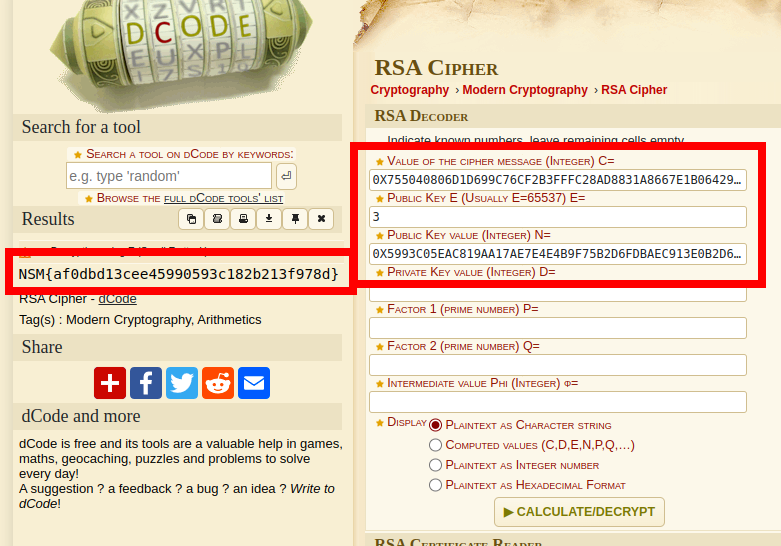

# Alle gode ting er tre

Alveresepsjonen fant en mystisk lapp i postboksen til Nissens verksted i dag tidlig. Vanligvis er dette noe Ronny, Shahana og Ada fra alvdeling for kryptografi ville tatt seg av. Dessverre er alle tre bortreist på en viktig konferanse i San Francisco for å høre om den siste utviklingen innen eksponenter og modulær aritmetikk. Kan du steppe inn for dem og finne ut av hva denne beskjeden egentlig er for noe?

\- Mellomleder

📎msg.txt

# Writeup

I quickly got the flag by using [dcode.fr](https://www.dcode.fr/rsa-cipher). Pasted the 3 values in and got the flag.



# Flag

```
NSM{af0dbd13cee45990593c182b213f978d}
```