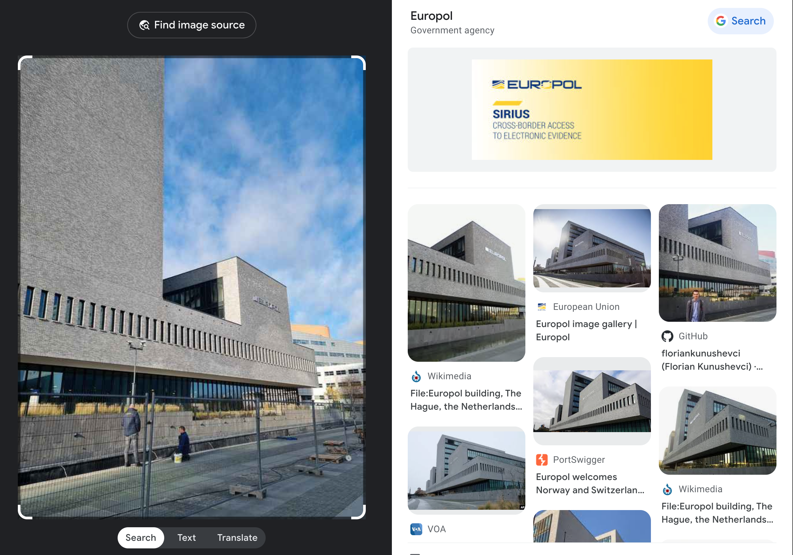
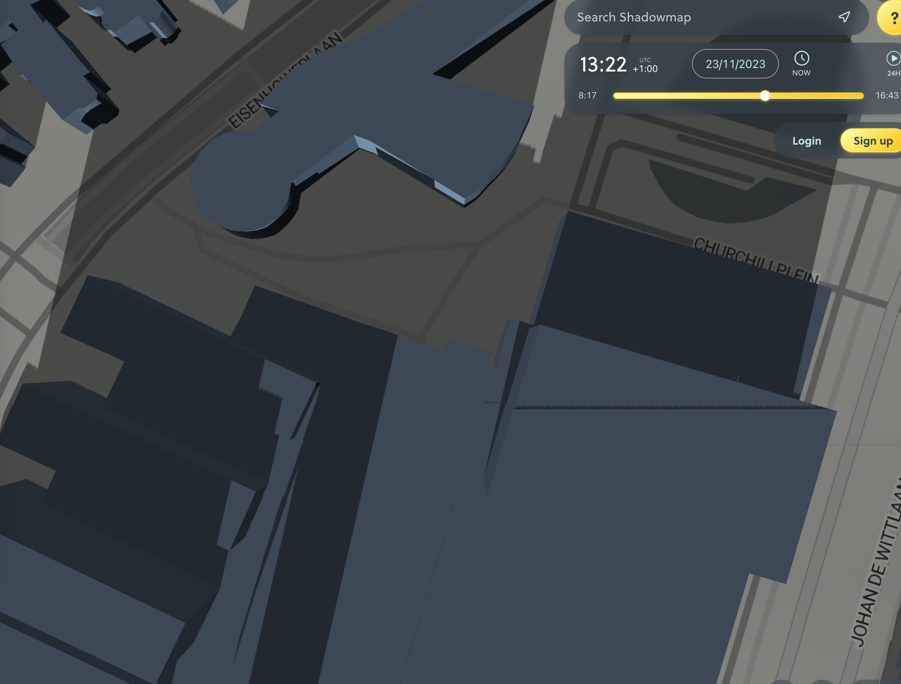

# Kronolokalisering

Gjennom et beslag har vi fått tak i et papirark. På den ene siden står det “Oppmøtested for den topphemmelige sydpolinfiltrasjonen 2023, rekognosering 23. november”. På den andre siden av arket er det et bilde. For å kunne hente inn overvåkingsbilder og identifisere hvem som har planlagt arrangementet trenger vi det nøyaktige tidspunktet bildet er tatt.

Send meg svar på denne eposten som KRIPOS{tidspunkt}, f.eks. KRIPOS{23:35}, rundet av til nærmeste fem minutter.

\- Mellomleder

[📎 bilde.jpeg](bilde.jpeg)

Regler

# Writeup

52°5'34.84"N, 4°16'52.25"E.

https://commons.wikimedia.org/wiki/File:Europol_building,_The_Hague,_the_Netherlands_-_968.jpg#filelinks

shows camera positon

N52° 05′ 34.84″ N, 4° 16′ 52.25″ E Kartographer map based on OpenStreetMap.

52.09287320674985, 4.2815265118097106

https://app.shadowmap.org/?basemap=map&elevation=nextzen&f=29.0&lat=52.09287320674985&lng=4.2815265118097106&time=1702123737296&vq=2&zoom=15.00

https://shademap.app/@52.0931,4.28228,18.04637z,1700742824774t,0b,0p,0m!1700723837033!1700754238539,qRXVyb3BvbCBidWlsZGluZywgVGhlIEhhZ3Vl!52.06778!4.35325

https://app.shadowmap.org/?lat=52.09322&lng=4.28279&zoom=17.69&azimuth=0.00000&basemap=map&elevation=nextzen&f=29.0&polar=0.00000&time=1700742136000&vq=2

# En annen sin løsning
https://www.suncalc.org/#/52.0931,4.2821,19/2023.11.23/13:20/1/1