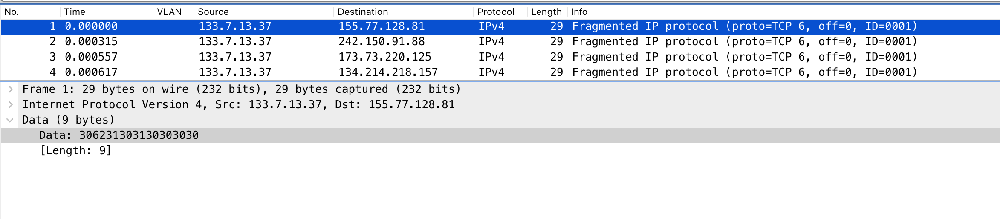
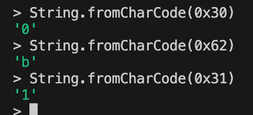

# Pakkestorm

Jeg har vært på et temmelig hemmelig oppdrag og fulgt med på en server som har hatt mistenkelig oppførsel tidligere. Nå tok vi den igjen når den begynte å sende masse pakker, men selv om jeg som alle andre alver liker pakker så ble det litt for mye av det gode. Kan du finne de onde for meg?

- Tastefinger

[📎fangede_pakker.pcap](./fangede_pakker.pcap)

# Writeup

Opened and saw aroudn 350k packages all looking equal ish, 9~ bytes and containing the same numbers.



Not quite sure what to do. I extracted all the packages from a random IP (49.182.1.36) to be this block:

```
306231303130303030
306231303130303131
306231303130313030
306231313131303131
306231303031303031
306231303131313131
306231303030303131
306231303030303031
306231313031313130
306231303131313131
306231303031303030
306231303030303031
306231303131303130
306231303131313131
306231313130303131
306231313130313031
306231303030303130
306231303131303130
306231313130313030
306231303030303031
306231303031313130
306231303130313030
306231313031303031
306231303030303031
306231303031313030
306231303131313131
306231313031313030
306231313030313031
306231313030313131
306231303031303031
306231303130303131
306231303031313030
306231303030303031
306231313130313030
306231313031303031
306231313031313131
306231313031313130
3062313030303031
306231313131313031
```

After a bit of looking I saw a pattern. `3062` is the same as `0b` when converted from hex to string. 



It looks like this is binary strings. Converted the first one of the random IP it resolved to `P`. The next is a `S`.. Did I find the flag on the random IP? I make a script to automatically get this:

```python
import pyshark

cap = pyshark.FileCapture("fangede_pakker.pcap")

for packet in cap:
    if packet.ip.dst == "49.182.1.36":
        binary_string = bytes.fromhex(packet.data.data).decode('utf-8')
        ascii_char = chr(int(binary_string, 2))
        print(ascii_char, end="", flush=True)
```

This returned: `PST{I_CAn_HAZ_suBZtANTiAL_legISLAtion!}` but that seems to fail. Now let me get every IP's converted:

```python
import pyshark

cap = pyshark.FileCapture("fangede_pakker.pcap")
all_ips = {}

for packet in cap:
    binary_string = bytes.fromhex(packet.data.data).decode('utf-8')
    ascii_char = chr(int(binary_string, 2))
    
    if packet.ip.dst in all_ips:
        all_ips[packet.ip.dst] += ascii_char
    else:
        all_ips[packet.ip.dst] = ascii_char

for k, v in all_ips.items():
    print(f"{k} = {v}")

```

After a while I got this [list](all_flags.txt). This seems to be something more to figure out. The text spesific tells me to find the `Evil` one. I search by text `evil` and nothing. I investigate more in Wireshark and I see the `time to live` changes for each package so I try to add them to the list. So for each package pr IP I sum the TTL. Maybe the package with a TTL of `666` (Number of the beast). 

```python
243.69.181.121 = PST{They_CAN_HAZ_zYMPAThETic_COnNECtIOn?} = 666
74.207.151.185 = PST{theY_CAn_haZ_prEseNt_enVIrOnMeNt?} = 666
10.171.160.56 = PST{ZHe_CAN_HAZ_iLlUStriOus_cRiTIcism!} = 666
234.156.218.206 = PST{zHE_CAn_HAZ_diZMaL_mESSaGe!} = 666
194.51.67.189 = PST{wE_cAN_HAZ_KALeidozcOPic_zTUdeNt!} = 666
91.135.241.103 = PST{ZhE_CAN_Haz_ztRIDeNt_ImprEZsION!} = 666
121.93.253.206 = PST{I_CaN_HAZ_AbSOLUTE_COMMuNIcaTioN?} = 666
188.71.154.100 = PST{it_CAN_HAZ_zChOLArLY_iNZtITUTIOn!} = 666
148.6.141.118 = PST{YOU_CAN_HAz_FantaSTic_MiNISTer!} = 666
57.86.29.160 = PST{HE_CAn_HaZ_cYlindrIcAL_frIeNd!} = 666
237.128.90.41 = PST{tHey_CAN_hAz_violEnt_InzuraNCE!} = 666
110.112.134.9 = PST{it_CAN_HAZ_InsuBStaNTIAl_MemOrY!} = 666
176.51.109.97 = PST{theY_CAN_HAz_ElDErLY_mATerIal!} = 666
140.220.15.62 = PST{thEY_cAN_HAz_poLiticaL_muRDER!} = 666
40.18.18.152 = PST{YOu_can_HAz_waRMheaRTed_raIlwaY!} = 666
106.249.46.121 = PST{yOU_can_HAZ_adOraBLE_sUrvEY?} = 666
124.150.249.74 = PST{it_Can_HAZ_ilLITERAtE_FeATUrE!} = 666
13.120.186.120 = PST{yOU_CAN_HAZ_PriztIne_lEWiZ!} = 666
```

I'm overthinking this. 


# Flag

```

```