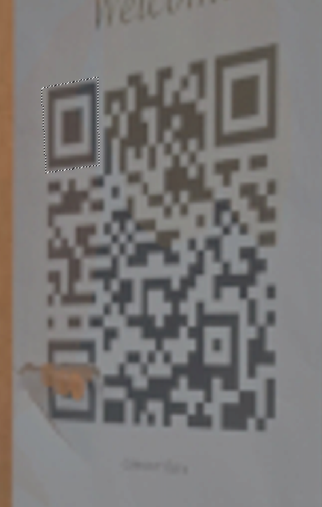
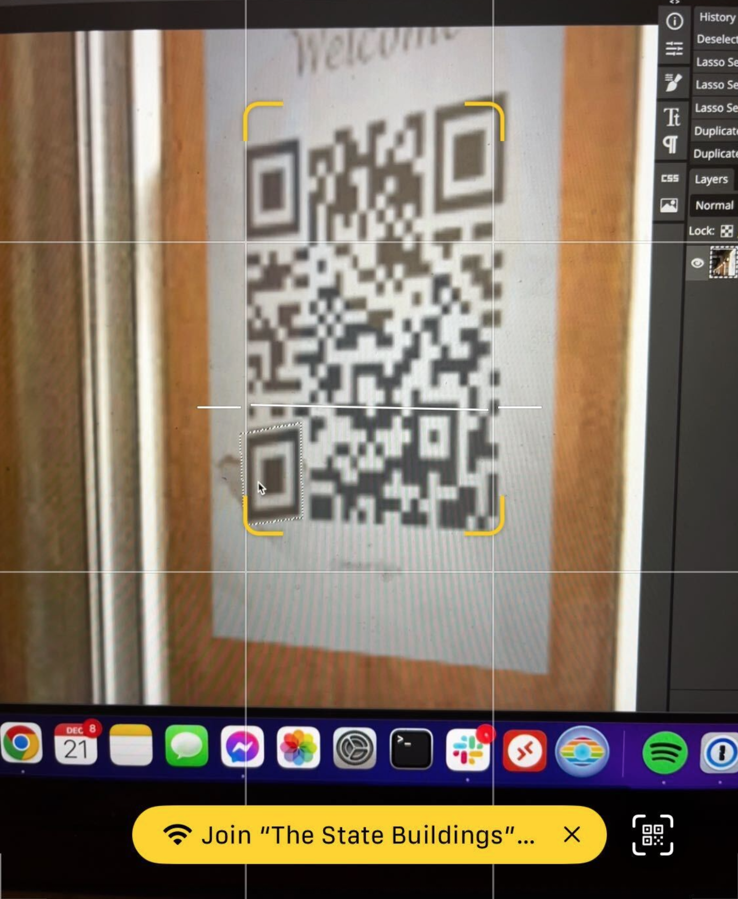

# GeoGjettr

Ledelsen har fått dilla på GeoGjettr og jeg er med i en konkurranse, men klarer ikke finne ut av hvilken by bildet her er fra. Kan du hjelpe meg litt fort?

Svar meg med KRIPOS{navn på by}.

- Mellomleder

[📎bilde.jpg](bilde.jpg)

# Writeup

The image shows a QR code which I quickly tried to scan but failed. Missing a big chunk of the bottom left control bit. 
I could do multiple things but the quickest was to open it in Photopea and just fix the missing bit by copying the top left one.



Then drag that down and scan it



Then a quick google for the WiFi name: `The State Buildings` shows me this


# Flagg

```
KRIPOS{Perth}
```
