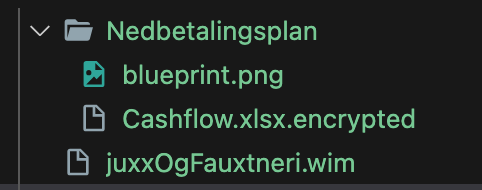
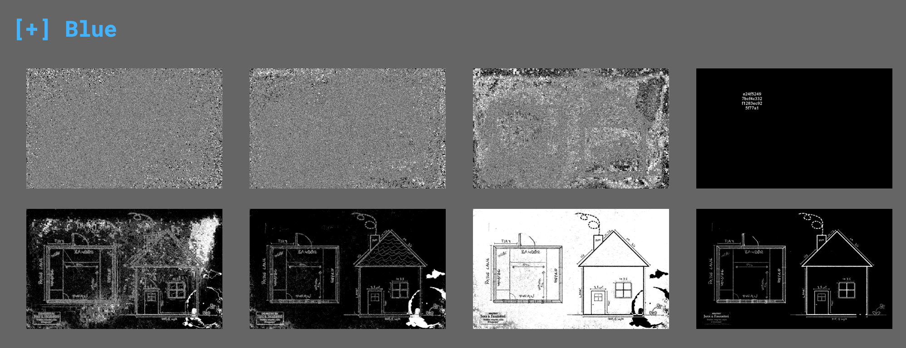

# KVU-dokumenter

Hei Toffe,

Taskforce ALV utvides stadig og trenger derfor nye lokaler, og dermed er det satt i gang en Konseptvalgsutredning.

Vi har leid inn arkitektfirmaet Juxx og Fauxtneri for å bistå med forslag til nye bygg. Men i lys av aktuelle hendelser har vi innsett at vi må gå arbeidet deres litt mer i sømmene.

Vi må forsikre oss om at det ikke skjuler seg noe juks eller fanteri i arbeidet deres. Vi har fått tilgang til budsjettet deres, og et utkast til et nytt bygg. Problemet er at budsjettet er kryptert, så vi får ikke lest det. Har du noen alternative løsninger?

[📎](./juxxOgFauxtneri.wim)

# Writeup

Never seen `wim` extension but File tells me this:

```bash
└─$ file juxxOgFauxtneri.wim                                             
juxxOgFauxtneri.wim: Windows imaging (WIM) image v1.13, reparse point fixup
```

[Archlinux Wiki](https://wiki.archlinux.org/title/Wim) shows I can mount this in linux using wiminfo and wimmount. Mounting it shows me two files.



Uploading the PNG to [AperiSolve](https://www.aperisolve.com/225fa815f20c88ccf7968555d22244fc)  shows me some hidden data in blue[4]. 



```
e24f52497bcf4c332f1283ec925f77a1
```