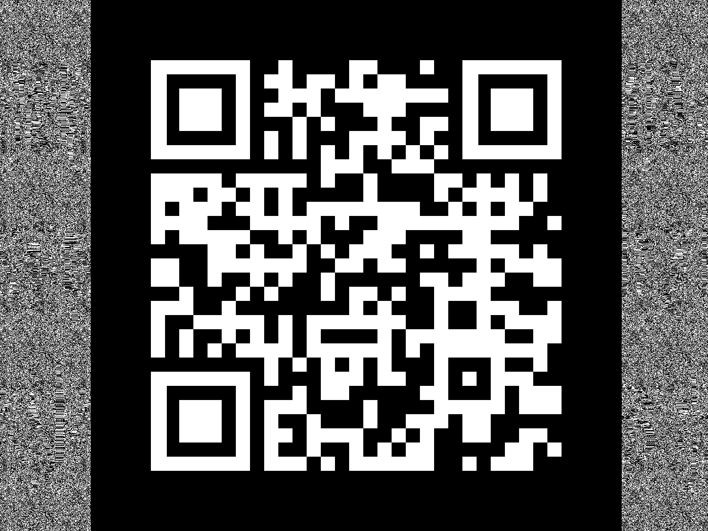
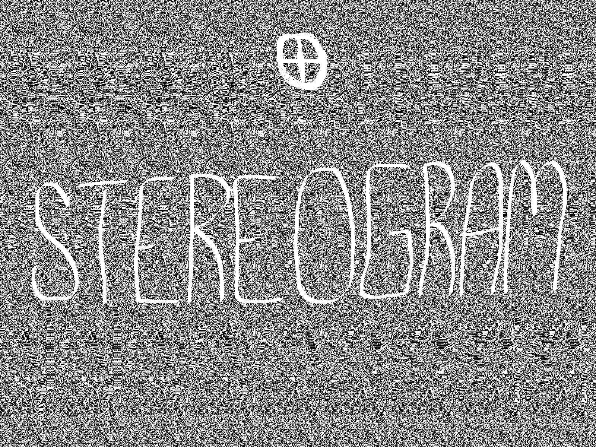
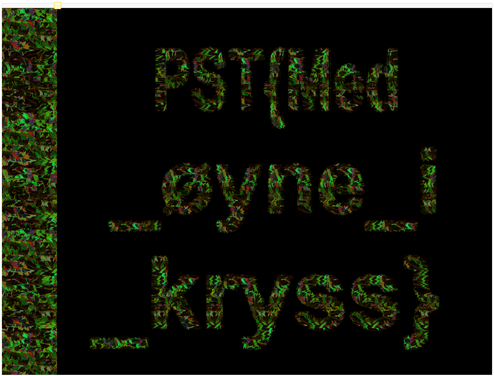

# Vårrengjøring

Mellomleder ba meg se på dette bildet i går, men nå har jeg stirra på det til jeg blir skjeløyd og finner ingenting! Kan du ta over saken?

Tastefinger

PS: Om du trenger en rubber duck for å debugge noe kan du låne stegosauren som står på plassen min.

[📎 bilde.png](bilde.png)

# Writeup

Did the quick exiftool check, nothing. strings, nothing. Opened it in stegonline and saw on the RGB channels. On `red 0` I was met with an QR code.



This was nothing, so browsing forward I saw this on `green 0`



Googling `online stereogram solver` I found [this](https://magiceye.ecksdee.co.uk/)

When uploading the image I got this image:



# Flag

```
PST{Med_øyne_i_kryss}
```