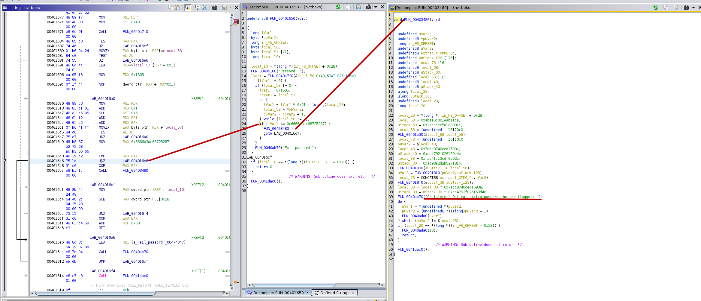
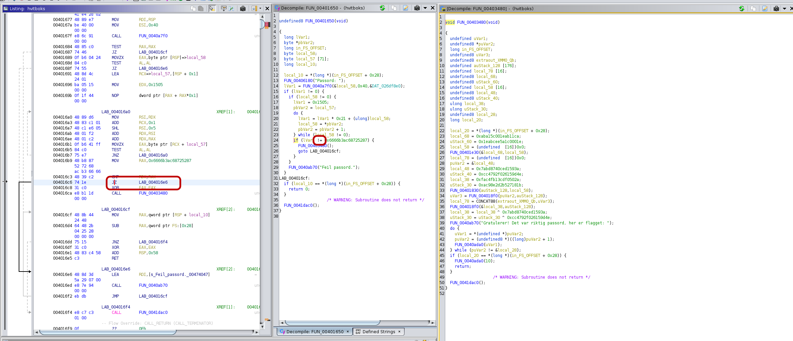

# Hvit Boks

NPST har hentet frem et beslag de tror kan ha en sammenheng med hendelsen sist jul. Beslaget ble tatt av en hvit boks med "lappes dualistisk" tusjet på. NPST har sett på dette fra alle kanter, men ikke funnet ut av noe.

Her må det nok en kylling til!

Mellomleder

[📎 hvitboks](hvitboks)

# Writeup

Identified the file using `file`:

```
$ file hvitboks 
hvitboks: ELF 64-bit LSB executable, x86-64, version 1 (GNU/Linux), statically linked, BuildID[sha1]=d4b8aedac09da8af252181ff0bc5ebde30fa7b3a, for GNU/Linux 4.4.0, stripped
```

Stripped, meh.. Time to find entrypoint: 

```console
$ objdump -f hvitboks

hvitboks:     file format elf64-x86-64
architecture: i386:x86-64, flags 0x00000102:
EXEC_P, D_PAGED
start address 0x0000000000401700
```

We got the start address so now lets get that function as assembly:

```console
$ objdump --start-address 0x401700 -d hvitboks | awk '{print $0} $3~/retq?/{exit}'
0000000000401700 <.text+0x640>:
  401700:       f3 0f 1e fa             endbr64
  401704:       31 ed                   xor    %ebp,%ebp
  401706:       49 89 d1                mov    %rdx,%r9
  401709:       5e                      pop    %rsi
  40170a:       48 89 e2                mov    %rsp,%rdx
  40170d:       48 83 e4 f0             and    $0xfffffffffffffff0,%rsp
  401711:       50                      push   %rax
  401712:       54                      push   %rsp
  401713:       45 31 c0                xor    %r8d,%r8d
  401716:       31 c9                   xor    %ecx,%ecx
  401718:       48 c7 c7 50 16 40 00    mov    $0x401650,%rdi
  40171f:       67 e8 3b 2f 00 00       addr32 call 0x404660
  401725:       f4                      hlt
  401726:       66 2e 0f 1f 84 00 00    cs nopw 0x0(%rax,%rax,1)
  40172d:       00 00 00 
  401730:       f3 0f 1e fa             endbr64
  401734:       c3                      ret
```

Here we have the call for probably `__libc_start_main` on `40171f`. the `mov` right above there is adding the actual program's start address to `rdi` which is the first parameter in a `call` function. So we know our program starts at `0x401650`.

Now opening this in **ghidra** I can easily see that address has an `JNZ` condition which seems to lead to the function which shows the flag:



Just patching that `JNZ` to `JZ` changes that if so any wrong passwords work:



Now running it and typing any passwords except the correct password shows the flag.

# Flag

```
PST{MANNEN_SOM_LEKTE_MED_MINNET}
```
