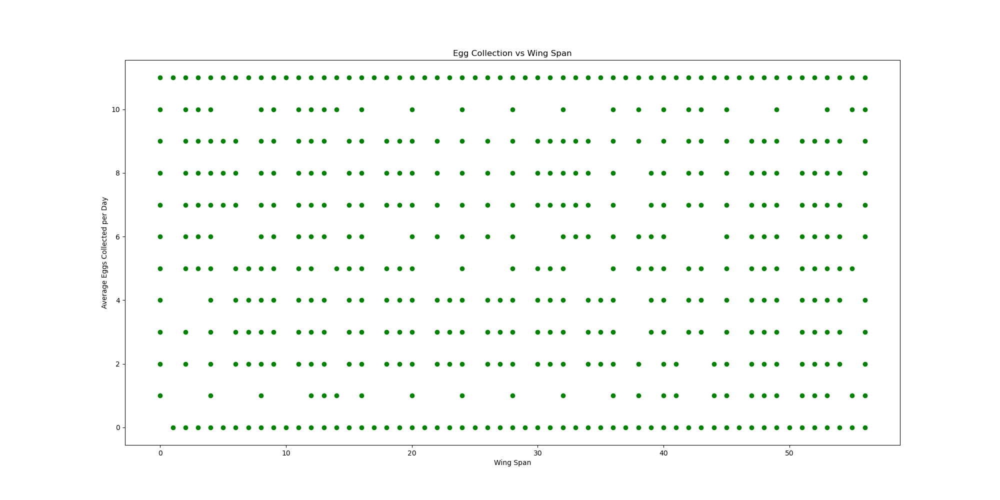
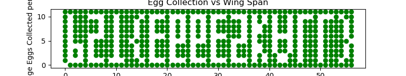
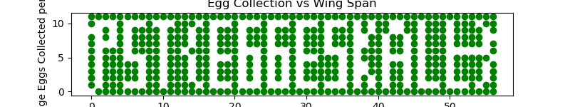
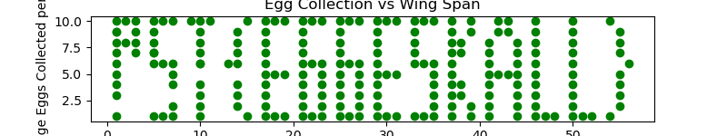

# Dataforskning

Hei Toffe,

De siste årene har man på Påskeøya drevet med datainnsamling på påskekyllingene.

[📎innsamlet.csv](./innsamlet.csv)

Hensikten er å kunne kategorisere kyllingene i to typer kyllinger, den ene egnet for EGGSamling, og den andre mulig egnet for å flY. Kanskje du kan bruke dette til noe? Akkurat hva som skal gjøres med dataen er vi litt usikre på, men noen mener at den kanskje bør visualiseres.

# Writeup

Saw it talk about visualizing so I started plotting. The type indicates that there is two sets of data here. One for the EGG and one for the flag. 

Taking this into python's pyplot made it easy to visualize. I did not really know what was X and what was Y but using the first column as X, second for Y and third for which dataset to extract I get this.



It did not make any sense, after a while I asked for a tip and got a tip to make it smaller. I changed graph size and this came out:



And there it is upside down. Lets reverse the X axis.



Still not perfect but readable. Not sure what the glitch is on the P and the bracket. But I get the flag.

Trying the '1' dataset seems to only give me the inverted flag. So guessing that is all.



# Flag

```
PST{EGGESKALL}
```