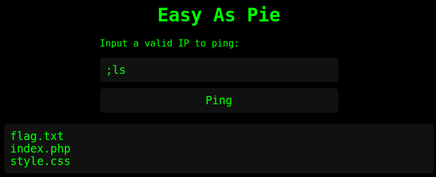

# 1 - Easy As Pie

Once in a remote Norwegian town, a group of skilled security professionals had convened in a fancy cabin to collaborate and achieve their objectives. On their network, they found a number of challenges that required their collective expertise. Do you have what it takes to tackle these challenges too?

http://rsxc.no:9005

# Note

Due to my findings in no 3-6 of this challenge the challenge has been updated. So flag is no longer in webroot but in system root. But all writeups still works but the flag seems to be moved to `/flag.txt`

# Writeup

After a lot of input, any type of injections I could find I suddenly got output with the `;ls`. There I found out that this was a bash script injection.



Flag was quickly captured by `;cat flag.txt` then I analyzed the `index.php` file:

```php
<?php
if ($_SERVER['REQUEST_METHOD'] == 'POST') {
    $ip = $_POST['ip'];
    $output = shell_exec("ping -c 1 $ip");
    echo "<pre class='output'>$output</pre>";
}
?>
```

This seems to be the format for most of the challenges in "The Hacker House". The weird thing is that entering a valid IP outputs nothing. I expected this output atleast.

```console
toffe@kali:~$ ping -c 1 localhost                                           
PING localhost(localhost (::1)) 56 data bytes
64 bytes from localhost (::1): icmp_seq=1 ttl=64 time=0.036 ms

--- localhost ping statistics ---
1 packets transmitted, 1 received, 0% packet loss, time 0ms
rtt min/avg/max/mdev = 0.036/0.036/0.036/0.000 ms
```

Which would have made the task a whole lot simpler. But it seems like they are using a docker enviroment without the `ping` command as I could not find it in `/usr/bin` when looking there.

# Flag

```
RSXC{THE_FIRST_ONE_IS_SIMPLE_BUT_THEY_WILL_BECOME_HARDER}
```