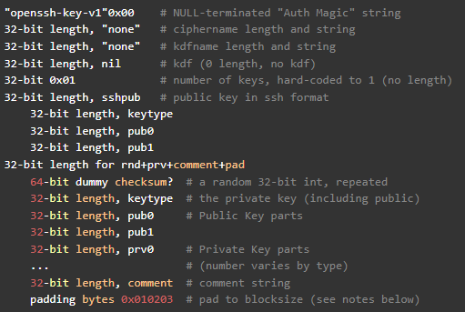

# Partial

We intercepted this encrypted flag, and we previously gathered this rsa key but something seems off. Can you help us decrypt it?

[id_rsa](id_rsa) [flag.encrypted](flag_encrypted)

# Writeup

Base64 decode of the key shows me `openssh-key-v1`, and `simen@simen` which is the one who created the key I guess. So now I just need to hack his computer and get to `/home/simen/.ssh/id_rsa`.. Or do this the hard way.. 

Firstly I made a script to extract the base64 string from the PEM encoded `id_rsa` file. Then with that data I can continue decoding the key.

Googling the `openssh key format` got me to [this website](https://coolaj86.com/articles/the-openssh-private-key-format/) where I could see the format used for the OpenSSH key.



This seems to match really nice with the key we have with the same header so parsing it like this using [parse.py](parse.py) which I wrote gave me this output: (Truncated some data for readability)

```
keytype:  ssh-rsa
pub0:  010001
pub1:  fffffffffff*truncated*
dummy:  31a485fc31a485fc
keytype:  ssh-rsa
pub0:  fffffffffff*truncated*
pub1:  fffffffffff*truncated*
prv0:  00d79ebd8b1*truncated*
prv1:  40747601ba10f54d28*truncated*
prv2:  00efd29b1852*truncated*
prv3:  00de59ed8a620*truncated*
comment:  simen@simen
```

So this shows me that I have all the private data and should be able to regenerate the public key. Also I should be able to decrypt the flag? Public keys are not needed as far as I know. 

After a bit of googling I found the formula to encrypt data was to convert it to hex, then get the data as a number. Then use `pow(data, e, n)`. Then to revert it you can do the same. Get the encrypted data as a big int, run `pow(data, d, n)`.   

I found out that `d` was the value of prv0 and `n` is `prv2*prv3`. So I had all the numnbers I just had to math it. I made [solve.py](solve.py) to do the heavy lifting.

I did just  get gibberish out many hours of testing. It complained about `non-hexadecimal number found in fromhex()`. I could not figure out what was wrong, but then I randomly tested adding another character as the hex was not divisible by 2. Then adding a 0 on the end gave me a successfull but wrongful output.

I then found out that the 0 should come first. When I did that I got the flag in plaintext + a bit of garbage.

```
b'\x00\x02X;\xb3d8\xfe\xfeK0\xecd\xd2\xc41R@*l\x8e\xe32\x82\xea0A\xf3;\xc3\xcb\x12\xa9\xf2\xc6 \xd4\n7\xc1\xa3\xda\x1b\xf9\xd87\x87\xd4\xbb\xcbs\xd8\xd1f(%\xe0\xa0\xceJ\x92\xcfM\xe8\xb3\x8a3K\x1e?`\xeaKq\xfe\xe8\xb8\x90\xcb\xec8{\xac\xb0\x1a\xda\xea\x94\x04\x03?\xbd\x9e\x7fN\x99\xe9,\xcft\xa7\x8c\\\xff\xbfT\xdb<\xca\xb1\xd4n\xabV\xaex\x9a\x9bnY9\xa4\xac\xee\xfe\x8d\xa1\x8d\xa6\xb9\xe8\xb1\xac\xc9Xu\x84\'\xc5x\xc4\xa7m\x1emBD\xf6O\xd4-\x80\xa8\x88q\x88\xc1\xd3Wly\xe6\xcd>\xd2\xa9\x84-.\xaa\xdbY\xcf\xf2\xb0a\xad($\x84;\xb3\x11\xadU\xf5\xa0r\x1f\x03\xcbr\x13\x14_\x8e\xa0<#\x0f{\xf1/\x1b-J6\xddI\x16\x99|a\xe4\xcc\xe4\x80\xa7\x86\xca\x95\xfa\x1a`\xa0w\xd7\x81\x8d\xd1c\x81\xc9/\x18c\xf106\x87j\xdb\xb8\xb5\x89\x07\xae\xf0\xe5Cs\x97\xe0tR\xce\x10c.\x92\xc9\x92\x91\xff\xe1\xd5\x8b\xf5\xa1\xc6m\xc2\xfb\xb2\x8eg@\x8b0\xb3\x8f\x12x\xde\xa9\xeb7\xdco\xc5\xcb\x17s\xa41\x0e66\xe3n\x1eAq\x81\xa0\xd6\xa8\x87G\x19IJ[\xa0\xe3Y4\xa5\x86\xc5\xe7\xe0\t%9\x7f\xfc\xb2\x8e)\xdc0\x93\x9d\xef\x83\x1a\xa1\xde\xddb\x93\xf5{\xc2x`\x02\xf8w\x17\xc4D)\xaeQ8\xbc\xc3MW\x95\x0c\x0c1\xde\xe0u\xb1i\xbb+\xa5\t1\xf5(\xd6\x80\xd2\x0ec\x03\xa6C6\xd7\xaew^\xf0\x8c6\x8dH0\xff3c\xe2\xd3\x1b\xf2U\xc6\t\xd1l\xddI+"\xb2\xca9\x8a@\x7f\xf9\xbb\x8c)\x1c6#\xb2\x1b#\xe4{\x9f\xf7\xaa\x14\xfc\x95\xa1\r\x80\xe82\x16E\xf6i\xc5\xf0\x9bs\x9c\x13\xe9\xf6Ro\xa8\xd2C\xa7\n\xb5\x00RSXC{You_managed_to_figure_out_how_SSH_keys_work}\n'
```

**Note**: After talking a bit to one of the employee's at River Security he figured out that the garbage was padding. Which would be parsed out if I did use a library instead of doing it 100% manually.. Oh well. I learned something :)

# Flag

```
RSXC{You_managed_to_figure_out_how_SSH_keys_work}
```