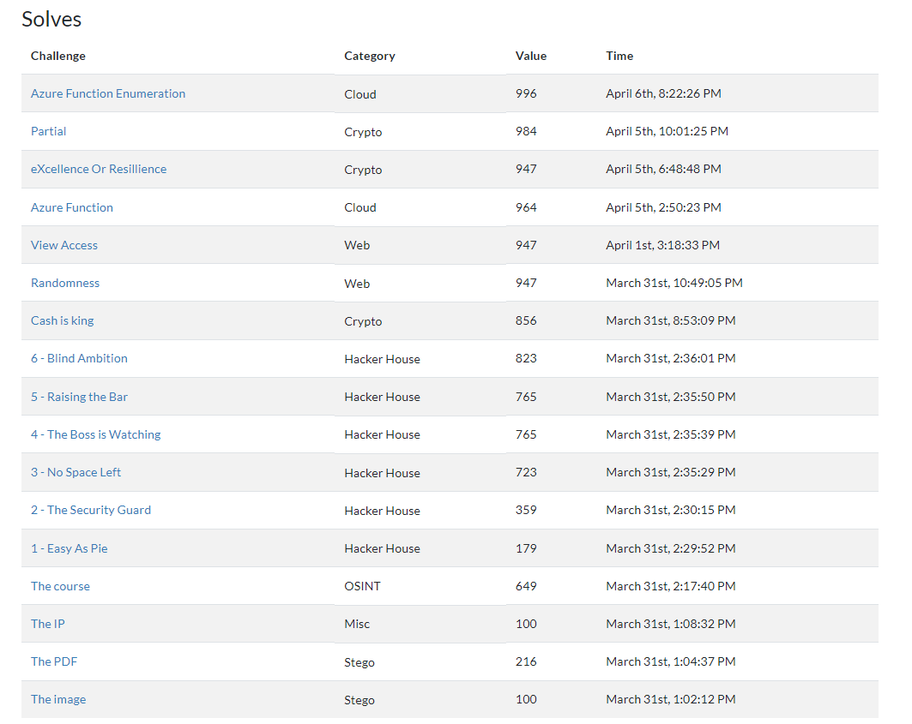

# River Security Eastern CTF

Participated in this CTF after a friend told me about it. The CTF contained a bit of guesswork as not everything had a "red thread". I'm not the biggest fan of that but it gave me a decent challenge. 

My personal favorite was the RSA task as I learned how RSA worked by researching this. It is quite simple but efficient. 

Had a few failed attempts, that was due to me misunderstanding the flag setup of [The Course](./The%20course/). I added `RSXC{}` around it until I finally understood it :P 

# Bragshots

**Note:** As the scores are dynamic the real scores might differ if someone solves them after the screenshot is taken.

