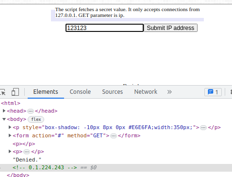
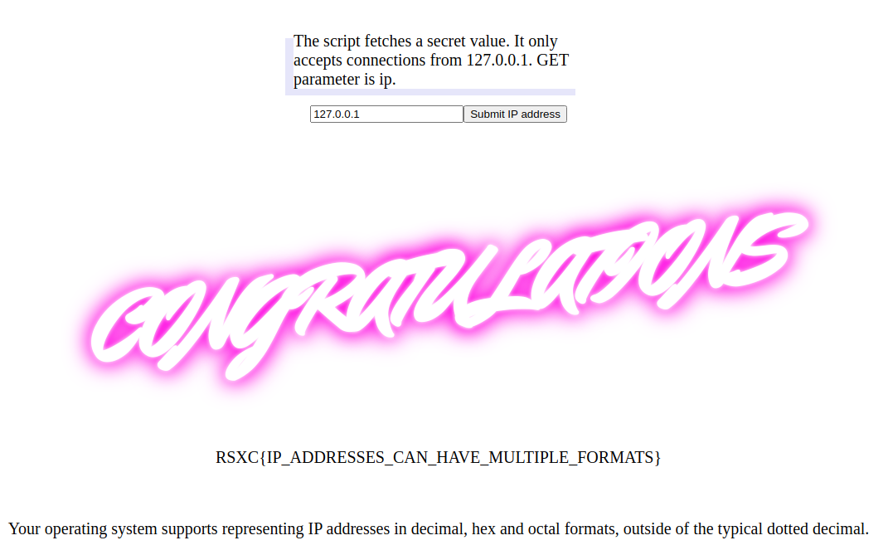

# The IP

Can you figure out how to bypass the filter and get the flag?

http://rsxc.no:9001

# Writeup

Opening the URL shows 

```
The script fetches a secret value. It only accepts connections from 127.0.0.1. GET parameter is ip.
```

Adding a random number shows "Denied" and watching the source code reveals a comment with an IP:



Based on this I quickly think that field creates a IP address from a number. This makes me think of "ip2long".. So I convert `127.0.0.1` to long `2130706433` and there I have it.



# Flag

```
RSXC{IP_ADDRESSES_CAN_HAVE_MULTIPLE_FORMATS}
```