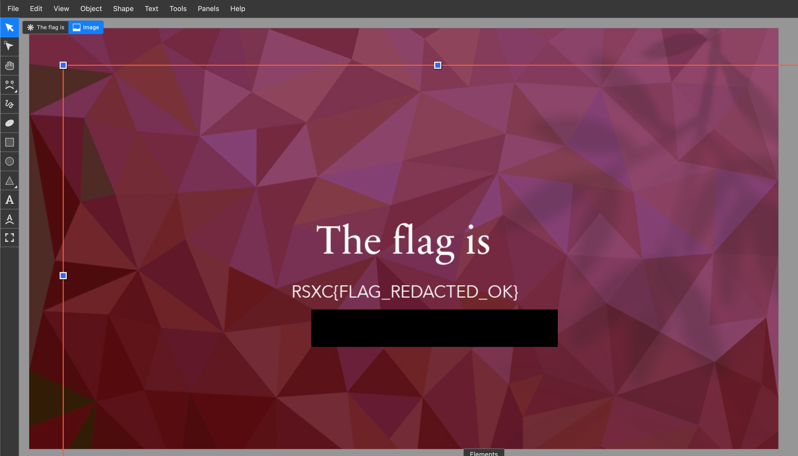

# The image

We found this image on a website, and there seems to be something redacted. Could you help us figure out what they tried to hide?

[image.svg](image.svg)

# Writeup

Quickly saw the black box and thought this was a layer above the code. So opened it in [Boxy](https://boxy-svg.com/app) and dragged the black box away and there it was. Did it this way as I did not have a editor or anything on the computer I used.



When writing this writeup I see that I could easily remove the black box by editing the SVG and removing the bottom `` tag.

# Flag

```
RSXC{FLAG_REDACTED_OK}
```