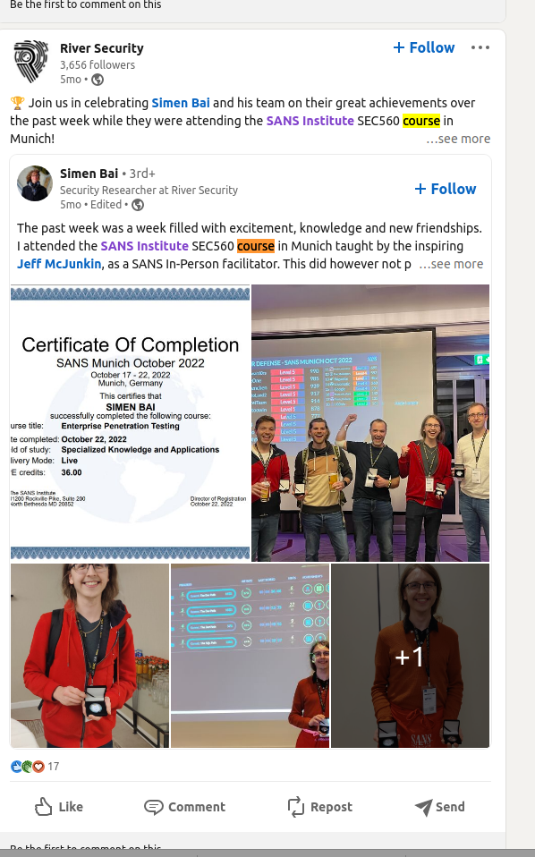
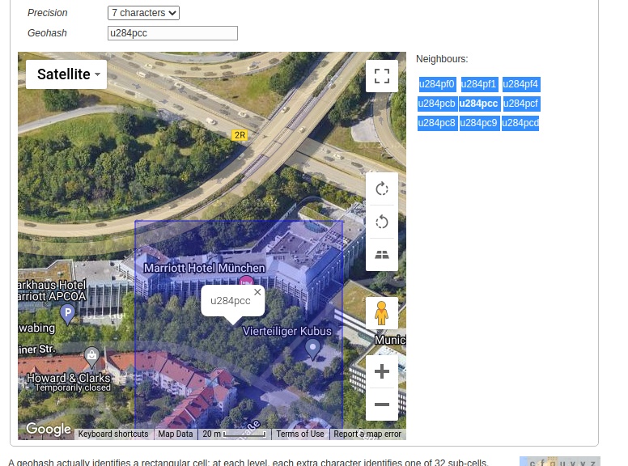

# The course

Last autumn (2022) one of our employees attended a course. Can you figure out who, and where?

The format of the flag (all lower case) is: : The geohash will be 7 characters long.

Example of flag format: mary:uqnx9ef

# Writeup

I quickly searched SOME for `River Security` and found them on `Linkedin`. Scrolling down until autumn 2022 I searched for the word `course` and found this post:



Then finding out where the SANS munich October 2022 were was a bit of a hazzle as all traces seems to have vanished. But I found the 2023 link and changed the url to have 2022

```
https://www.sans.org/cyber-security-training-events/munich-october-2022/
```

That redirected me to a overview page. So I tried to open it in [WayBackMachine](https://web.archive.org/web/20220901062034/https://www.sans.org/cyber-security-training-events/munich-october-2022/) and found snapshots from september on that url. And there we go, a full address!

```
Munich Marriott Hotel,
Berliner Strasse 93,
Munich 80805,
Germany
```

Googling that to get the coords, convert it to 7 characters long and we get this.



This did not work at first I thought. I tried to wrap the flag with `RSXC{}` many times until I finally understood it...  The flag was only the name and the location. So lots of backtracking and googling due to that but my bad not fully understanding the flag setup.

# Flag

```
simen:u284pcc
```