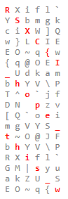

# eXcellence Or Resillience

We found this string when searching for some information.

`f8f3c9ddefd1f5c8feeef1c7dec8f8edcbefc3ccfdc1f6fdf5d3f0f8f1c7cbcef5c1fafddcc5e3c1f6fdf5ccf4fffffdce81b0bfb5e5`

Can you help us understand it?

# Writeup

`XOR` is highlighted so guessing I need to `XOR` it.

Guessing the flag starts with `RSXC{` and ends with `}` I can reverse the `XOR` values for 6 bytes. After a while I generated this key:

```python
[170, 160, 145, 158, 148, 0, 0, 0, 0, 0, 0, 0, 0, 0, 0, 0, 0, 0, 0, 0, 0, 0, 0, 0, 0, 0, 0, 0, 0, 0, 0, 0, 0, 0, 0, 0, 0, 0, 0, 0, 0, 0, 0, 0, 0, 0, 0, 0, 0, 0, 0, 0, 0, 152]
```

I need to find the key values for every other number. Looking for logic in the numbers I found nothing. So I started thinking since that is all, maybe I only need those values? The total number of bytes is divisible by 6. Which is the exact number of key values I have. I tried to make a script to just test all the values.

```python
ct = bytes.fromhex("f8f3c9ddefd1f5c8feeef1c7dec8f8edcbefc3ccfdc1f6fdf5d3f0f8f1c7cbcef5c1fafddcc5e3c1f6fdf5ccf4fffffdce81b0bfb5e5")

key = [0] * 6 
key[0] = ct[0] ^ ord("R")
key[1] = ct[1] ^ ord("S")
key[2] = ct[2] ^ ord("X")
key[3] = ct[3] ^ ord("C")
key[4] = ct[4] ^ ord("{")
key[5] = ct[53] ^ ord("}")

for c in ct:
  print(chr(c^key[0]),chr(c^key[1]),chr(c^key[2]),chr(c^key[3]),chr(c^key[4]),chr(c^key[5]))
```

This outputs, with some higlight from me:



If you read from the first character then move one to the left on next line and rolls around you can see a pattern `RSXC{I_hope_this_w`. So that tells me that the key is only these 5 values. I modify the script to [solve.py](solve.py) and get the key.

```python
ct = bytes.fromhex("f8f3c9ddefd1f5c8feeef1c7dec8f8edcbefc3ccfdc1f6fdf5d3f0f8f1c7cbcef5c1fafddcc5e3c1f6fdf5ccf4fffffdce81b0bfb5e5")

key = [0] * 6 
key[0] = ct[0] ^ ord("R")
key[1] = ct[1] ^ ord("S")
key[2] = ct[2] ^ ord("X")
key[3] = ct[3] ^ ord("C")
key[4] = ct[4] ^ ord("{")
key[5] = ct[53] ^ ord("}")

for idx, c in enumerate(ct):
  print(chr(c^key[idx % len(key)]), end="")
```

# Flag

```
RSXC{I_hope_this_will_be_safe_and_never_be_leaked!!!!}
```