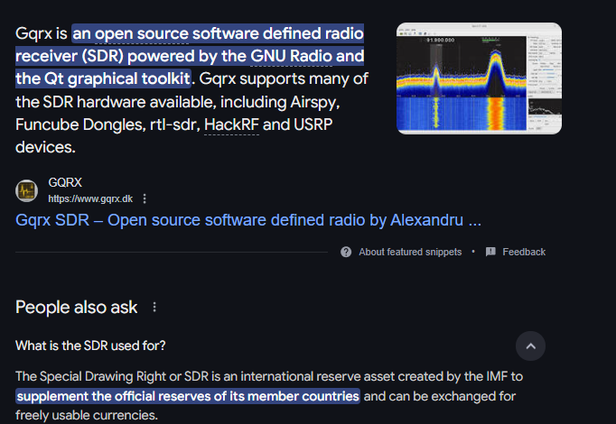
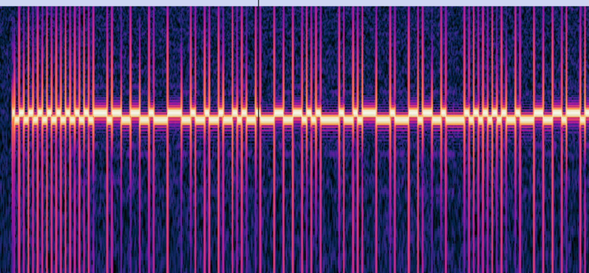
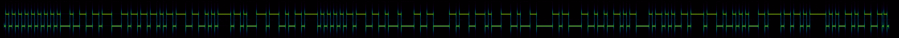
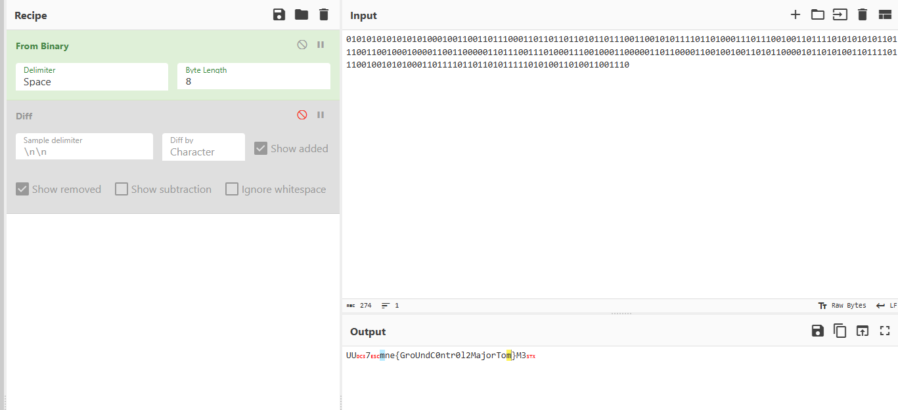

# .GGRX

Download and extract the gqrx_ file. This is an "IQ" binary, which is a common data format for storing signals recorded with software defined radios.

This file can be opened in almost all SDR / signal processing software such as GQRX and GNU Radio. See if you can find a way to decode the flag.

[⬇️ gqrx_20250207_112408_405000000_2000000_fc.7z](./gqrx_20250207_112408_405000000_2000000_fc.7z)

# Writeup

Quick google search for the file GQRX shows this

Opening the file in Audicity shows some binary content it looks like.

ChatGPT recommends to use `Inspecturum`, and it allows me to better adjust it

Adjusting it a bit  could make this image

Using this I know that we have pixels at top and bottom then I could make a python script to analyze from X0 -> X<width>. I see the preamble seems to set the pulse width to around 13 pixels. So I get it to start from 155px which seems to be the of a full first pulse, then skip 13 pixels until end of file. 

I run the [solve.py](./solve.py) script and get some binary and I am not able to fully decode it. But one of my teammates finally got it. After a while it is only about the amount of bits. If I remove one by one until I see the flag I got the correct flag right away here:

