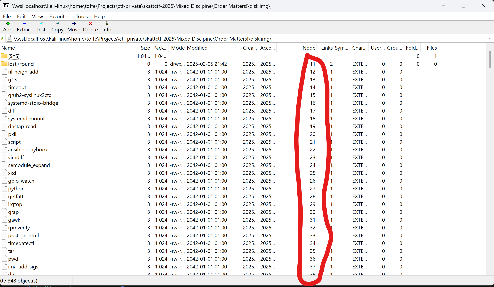

# Order Matters!

It should be a flag here, but you might need to re-order your head first!

The file is available to download below

[⬇️ disk.img](./disk.img)

# Writeup

Opening the img file in 7zip shows the iNode numbering:



Packing it out and catting every file it seems like it is a base64 but I need to get the order straight. Using "ls -i" shows that my iNode numbering is way off. So I need to mount it to keep their numbers.

```bash
mkdir disk
sudo modprobe loop
sudo mount -t ext4 -o loop disk.img disk
```

Showing `ls -i -l disk/` shows we now have the correct i numbering.

Now using some bash magic we get them all outputted and sorted:

```bash
$ ls -i -1 disk/ | sort -k1n | awk '{print "disk/" $2}' | xargs cat 2>/dev/null | base64 -d

mne{Th3_0rd3r_of_1n0d3s}


    Subject: Re: What does the "i" in inode stand for? Nobody seems to know...
    Date: Sat, 20 Jul 2002 00:52:39 -0400
    From: Dennis Ritchie <dmr@plan9.bell-labs.com>
    To: landley@trommello.org

    In truth, I don't know either. It was just a term
    that we started to use. "Index" is my best guess,
    because of the slightly unusua file systeml structure
    that stored the access information of files as a flat array on
    the disk, with all the hierarchical directory information living
    aside from this. Thus the the i-number is an
    index in this array, the i-node is the selected element
    of the array. (The "i-" notation was used in the
    1st edition manual; its hyphen became gradually
    dropped).

     Dennis
```

Cleanup with `sudo umount disk && rm -fR disk`