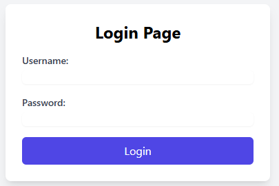
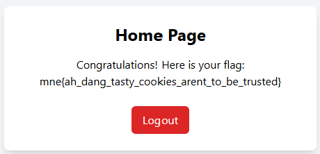

# Get Admin

I got this website, i need to get admin access to it. Can you help?

The website is available [here](https://nm01.bootupctf.net:8081/)

# Writeup

Welcomed with a login page 



Inspecting the source we see hardcoded credentials:

```html
<html lang="en">
<head>
    ...
</head>
<body class="bg-gray-100 flex items-center justify-center h-screen">
    <!-- Hardcoded credentials for testing: test / test -->
    <div class="bg-white p-6 rounded-lg shadow-lg w-full max-w-sm">
        ...
    </div>

</body>
</html>
```

When logging in it sets a cookie `user_level` to be `user`, changing this to `admin` and reload gives the flag.

