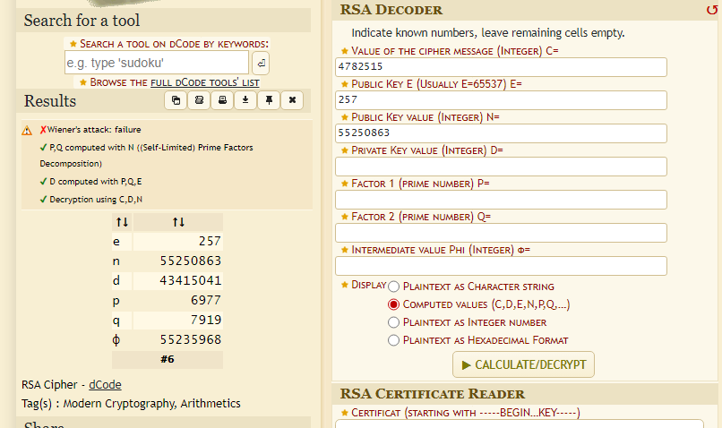

# More Encryption
1000
Author: Valkyrien

Du har klart å plukke opp en ny beskjed som tilsynelatende er kryptert. Vi har lykkes i å få tak i verdiene for n og e igjen, men resten må du hjelpe meg med. Etter du har dekryptert cipherteksten, så må du mappe korekte verdier der de hører hjemme: 1-29 er alfabetet, 30-39 er desimalsifre, 40 er et spørsmålstegn, 41 er en åpne krøllparentes,
42 er lukke krøllparentes, 43 er understrek, 44 er !, og 45 er -. Merk: Dette flagget har ikke "wrapperen" UiACTF{}, bare innholdet. Riktig svar er på formatet UiACTF{<innholdet>}

# Writeup

Used [dCode.fr](https://www.dcode.fr/rsa-cipher) to figure out the missing numbers of the RSA cipher.



Made a python script to decode one by one and map the numbers to the correct characters. The second last number in the `cipertext` was off by one s changed that from `18052186` to `18052185` gave a more sane number and flag. Also all was uppercase. All my fails went down on this.

```python
# Given ciphertext as a string of space-separated values
ct = "4782515 3050608 4782515 25980867 32285295 30343968 7939794 25980867 46759423 18052185 30343968 40451829 25980867 30981694 213841 30341871 4246111 25980867 3050608 31092914 25980867 22601046 7939794 18052185 23364785"
n = 55250863
e = 257
p = 6977
q = 7919
d = 43415041

# Convert ciphertext string into a list of integers
ct_numbers = [int(val) for val in ct.split(" ")]

# Decrypt each value in the ciphertext
decrypted_data = [pow(val, d, n) for val in ct_numbers]

# Mapping according to the provided rules
mapping = {
    # Alphabet (UPPERCASE)
    **{i: chr(64 + i) for i in range(1, 30)},
    # Decimal digits
    **{i: str(i - 30) for i in range(30, 40)},
    # Special characters
    40: '?', 41: '{', 42: '}', 43: '_', 44: '!', 45: '-'
}

# Decoding the message
decoded_message = ''.join(mapping[num] for num in decrypted_data if num in mapping)

print("UiACTF{" + decoded_message + "}")
```

```
UiACTF{D1D_Y0U_KN0W_M4TH_1S_FUN?}
```