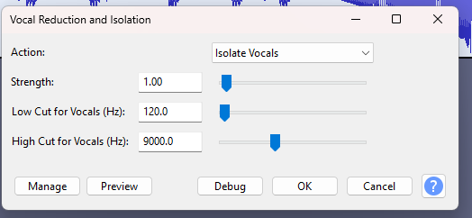

# Sounds Like Stego! Vol.1, 2 and 3

Vi har blitt overlevert denne sabla rare lydfilen, klarer du å finne alle flaggene? Det er tydelig i selve flagget hvilken oppgave som tilhører hvilket flagg.

Pass på hørselen når du løser oppgaven, skru ned volumet før du spiller av første gang!

[⬇️ sounds_like_stego.wav](./sounds_like_stego.wav)

# Writeup

This stego has 3 flags in it. The I did not solve part 2 and 3 but I found them while looking for number 1.

The first I found was part2 in the spectrogram.


The second part was some talking at around 11 seconds which seemd reversed. Using Audacity I used the effect `Vocal` noise reduction to remove some noise then reversed the audio



Playing that back a lady said: `The archive password is 184233965`

```bash
└─$ binwalk -e sounds_like_stego.wav 

DECIMAL       HEXADECIMAL     DESCRIPTION
--------------------------------------------------------------------------------
20861841      0x13E5391       MySQL MISAM compressed data file Version 5
24239240      0x171DC88       Certificate in DER format (x509 v3), header length: 4, sequence length: 32531
26499676      0x1945A5C       Zip archive data, at least v2.0 to extract, name: zipppydidoodaa/
26499721      0x1945A89       Zip archive data, encrypted at least v2.0 to extract, compressed size: 73, uncompressed size: 63, name: zipppydidoodaa/flag.txt
26500049      0x1945BD1       End of Zip archive, footer length: 22
```

Binwalk then did reveal a password protected zip file I could extract and reveal the flag.

`UIACTF{part_3_pressure_pushing_down_on_me_pressing_down_on_you}`

For the first part I remember a Geocache I tried to make once using a oscilloscope to generate waveforms from music. I found my oscilloscope but then I remembered there were a software for it luckily. [Smarter Every Day](https://www.youtube.com/watch?v=4gibcRfp4zA) made a video on this which explains it better than I can.

And using that software and some lucky timing I got a whole flag out:

