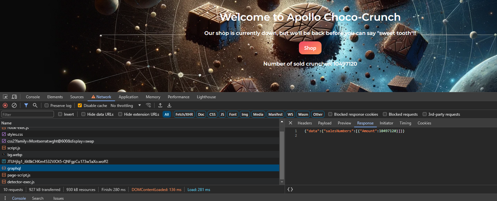
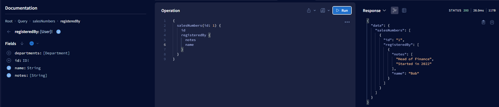
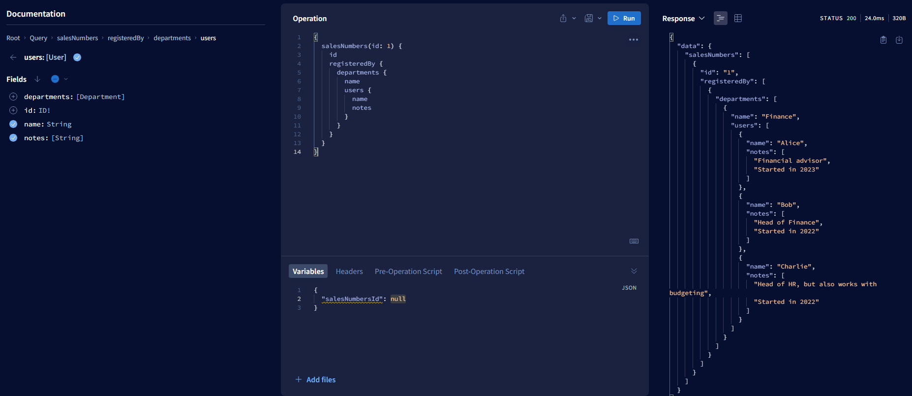
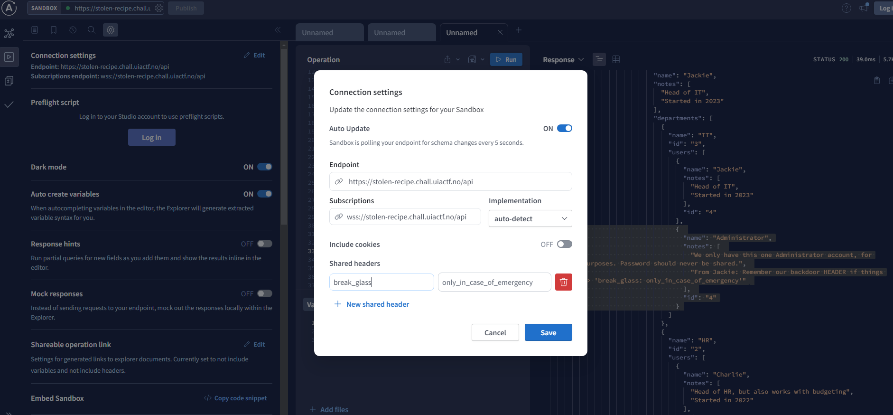
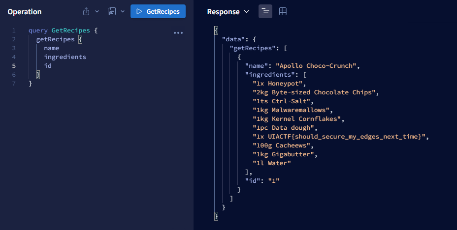

# Stolen recipe

Author: halvis v/mnemonic

Oh no! Our top-secret recipe for the groundbreaking Apollo Choco-Crunch has gone astray, stolen by the cunning Sweet Tooth Bandits! This was not just any recipe—it was our golden ticket, destined to redefine the candy landscape forever. In a digital heist, these confectionery marauders infiltrated us and got away with our culinary treasure. We have reason to believe our website was their gateway.

Can you figure out they got ahold of it?

https://stolen-recipe.chall.uiactf.no

# Writeup

On the network tab of the browser inspector there was a graphql query that was interesting.



Guessing we have to navigate the GraphQL, luckily @morty had already been researching this and found a nice tool for it [ApolloGraphQL Sandbox Explorer](https://studio.apollographql.com/sandbox/explorer/). He also found a query to get me started.

```graphql
query salesNumbers { salesNumbers(id: 1)  {
    Amount
    id
    registeredBy {
      id
      notes
      name
      departments {
        users {
          notes
          name
        }
      }
    }
  }
}
```

From what I understand here we do get free access to `salesNumber` queries. And this one is linked to a `User` table? (I'm a mysql person so just.. ignore it if it's totally wrong) with the `registeredBy` field. This link gives the name and notes for this user. 



It also gives us the department. From that department we can get the users in that department.

So we can see all users in that department and their notes and name: 



So if we take a closer look at Charlie which seems to work in HR? We can then get his departments, expand them to get the users in both his departments and so on. Until we find the IT department and the `Administrator` user. 

So the path is: 

```
1. salesNumber 1 is registered by Bob
2. Bob works in Finance
3. Finance has a user called Charlie
4. Charlie works in HR also
5. HR has a user called Jackie
6. Jackie works in IT also
7. IT has a user called Administrator
```

The IT Department looks like this:

```json
{
    "name": "IT",
    "users": [
        {
            "notes": [
                "Head of IT",
                "Started in 2023"
            ],
            "name": "Jackie"
        },
        {
            "notes": [
                "We only have this one Administrator account, for security purposes. Password should never be shared.",
                "From Jackie: Remember our backdoor HEADER if things go south => 'break_glass: only_in_case_of_emergency'"
            ],
            "name": "Administrator"
        }
    ]
}
```

Adding that backdoor header to the request we could get everything.



And in the recipes are the flag:



The query I used was this:

```
{
  salesNumbers(id: 1) {
    registeredBy {
      departments {
        users {
          departments {
            users {
              departments {
                users {
                  
                  departments {
                    name
                    users {
                      name
                      notes
                    }
                  }
                }
              }
            }
          }
        }
      }
    }
  }
}
```