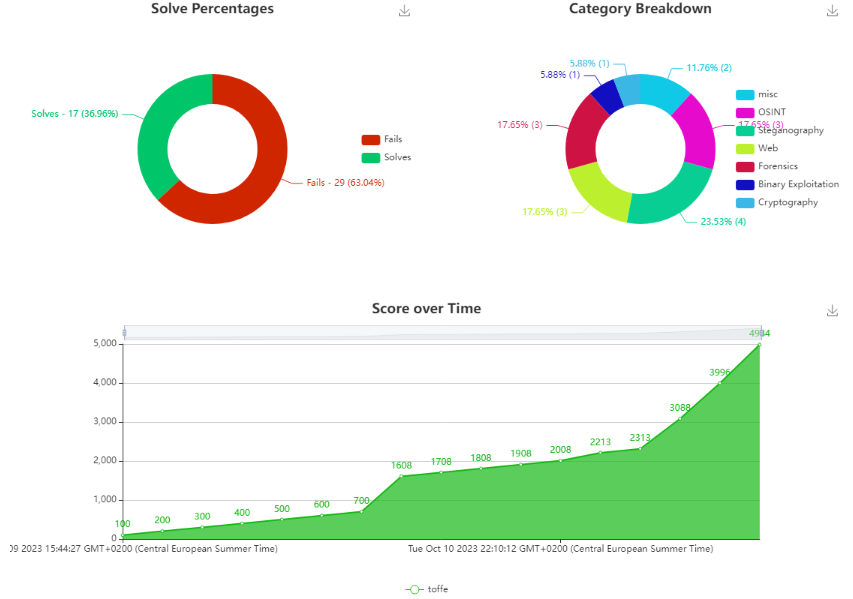

# Sikt

Participated in the Sikt CTF Provided by the [Norwegian cyber security centre for research and education (eduCSC)](https://sikt.no/tjenester/cybersikkerhetssenter-forskning-og-utdanning) for the Cybersecurity Awareness Month 2023.

# Thoughts

Something that annoyed me regarding this CTF was the lack of rules and information about flags. A few of the tasks you needed to manually wrap the flag with `siktCTF{}`. I did not know this and spent a lot of time trying to figure out what was wrong or if I was missing something. Another thing was that some did not have a wrap at all. So I knew the answer but kept searching for a long time.

Secondly one of the tasks required bruteforcing, but there was no rules if it was legal to brute or not. So firstly I did not do it until someone else did it. I think it is a bit sad that the rules are not clear. 

**Favorite challenge**: ComputerStick was a fun challenge. I've never done anything like that before. Even though it was easyy it was fun to learn something new.

**Least favorite challenge**: Phoenix Foundation, this felt like a whole lot of guessing in the start. Not a big fan of that, I like to have some sort of direction. My thought could be to put it in OSINT category. It could also have been a bit more clear that the discord server was supposed to act like the the office building (or atleast I think). I see that now in hindsight, but it was not clear at all when I was doing it. But fun challenge when I see the overview of it. 

**Final words**: I had a lot of fun on many of the challenges. would be fun to have a few more `pwn` challenges. Thanks for creating this :) 

# Bragshots

**Note:** As the scores are dynamic the real scores might differ if someone solves them after the screenshot is taken.

