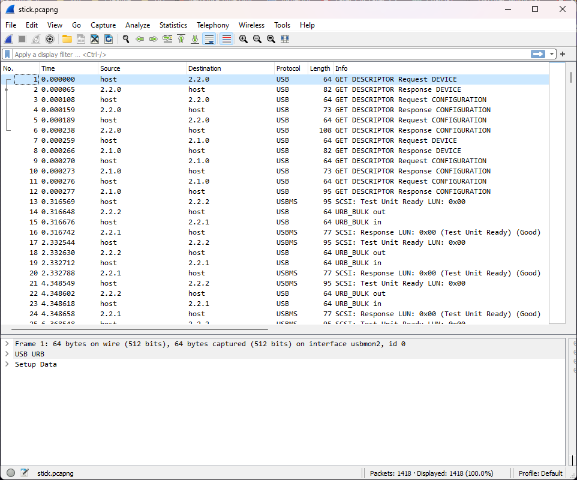
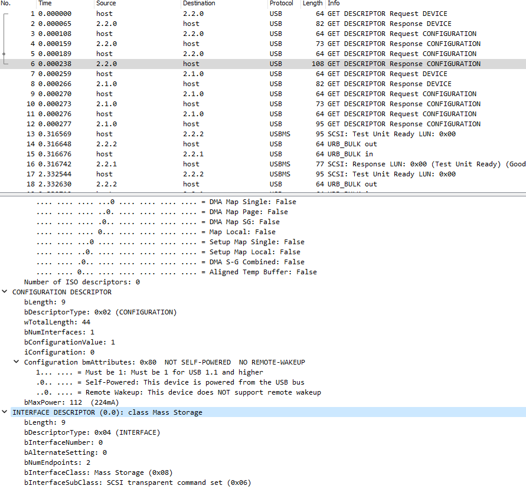
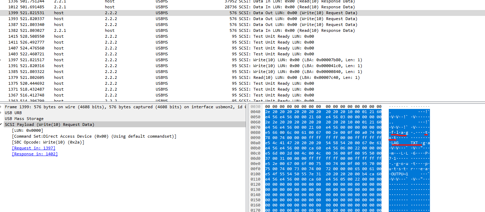
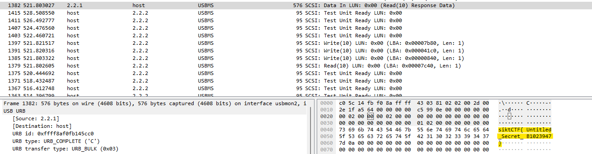

# ComputerStick (🪙 793)

Someone got a hold of some data that was transferred over a USB stick. Can you find out what data the USB stick took or put on the computer?

📎 [stick.pcapng](stick.pcapng)

# Writeup

Opening the file in Wireshark reveals the USB dump. 



We can see two devices connected and the host is requesting information.

Package #1-6 configures the first device, and package #7-12 configures the second. Looking at the first device, on package #6 we see that it classifies as a `Mass Storage` (in #2 we can see it identifies as a `ScanDisk Corp. Ultra` which also gives it away.) 



The second device seems to be a USB Root hub base on package #12

After a bit of Googling I find out to sort packages after size and start looking through them. Bigger packages = more data. 

Unfortunally most of them seems blank, filled with dummy data? Just 0x00.
Going quickly downwards I see something refering to a textfile:



Then right below I see the flag:




# Flag

```
siktCTF{Untitled_Secret_B1023947}
```