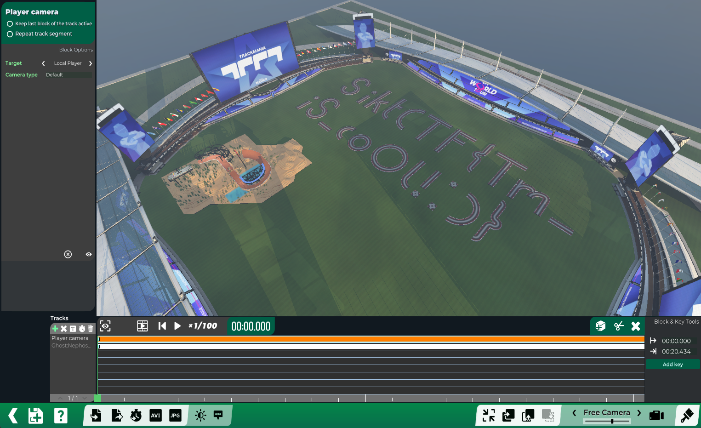

# Djort (🪙 1000)

I got a file from a friend along with the message "I finally got it". I have no idea what it is, but I think it might be important. Can you help me figure out what to do with it?

📎 [Djort0015402.Replay.Gbx](Djort0015402.Replay.Gbx)

# Writeup

Was ingame in CS 2 when I got this challenge. I had no idea what to do with it so I just downloaded it and googled quickly. I found out that it was a file for Trackmania. I hesitated to download the game, but found a few online resources to read it. [Link1](https://gbxexplorer.net/), [Link2](https://gbx.bigbang1112.cz/tool/replay-viewer).

This did not yeild any results so I downloaded the game and tried to open the file. It worked and I got a video of a car crashing. Nothing much. Then suddenly I moved the timeline and saw the words "sikt". Googling on how to enable freecam I could finally fly up and see this:



# Flag

```
siktCTF{Tm_iS_coOl!:)}
```