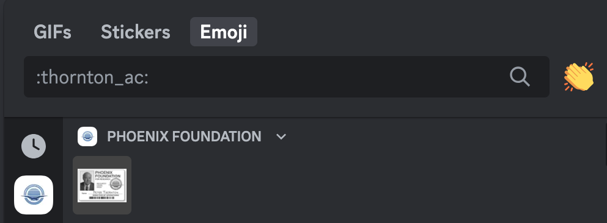

# PhoenixFoundation (🪙 991)

I have just landed a job at the Phoenix Foundation. My boss, Pete Thornton, is looking to expand the team. Are you up for the task?

https://discord.gg/tsU3EBK5Dp

# Writeup

Starting by joining the Discord server I see this:


Not knowing what to do I go to the boss "bot" of the channel named `Pete Thornton`.


I'm not very familiare with Discord so I give a bit up not finding anytihng else. Asks for a tip from a friend and he tells me to use `!knock` on the bot.


Seeing the base64ish string I try that and get `!decrypt_completed`


Now I'm flabbergasted. I've tried:

```
!hack                 !break_in                 !wallet
!search               !find                     !find_access_card
!give_access_card     !show_wallet              !swiss
!phoenix_foundation   !france                   !toulon
!in_the_office        !find_petes_access_card   !home
!pocket               !found_access_car         !access_card
!give_wallet          !glasses                  !look
!lockpick             !lostandfound             !inventory
!2-78167              !family                   !plastic
!purse                !floor                    !innocent
!america              !usa                      !drawer
!holster              !door                     + a lot more
```

Talked to someone who already completed this and he told me that this was more of a `osint` task than `misc` which boosted my search confidence. I started looking though discord server, MacFandom page, internet everywhere. Then it suddenly clicked. I earlier this day tried to send a few emoji cards with


Then I suddenly remember that Discord can have custom emojies and stuff. Maybe there, and.. yes there it is!



Clicked it and it shows that I need to pay for Nitro to use it. Knowing they wont put things behind paywall I tried `!thornton_ac` and it gets me further. Now it asked for a PIN. I tried a few standards, his discord ID, `0000`, `1234` and a few more.


Then his [birthday year](https://macgyver.fandom.com/wiki/Pete_Thornton). day+month, month+day and there it was. 


Then we got the last task, which shows a bomb and we need to type the location before it blows up. I tried "home" at random and it blew. But we had unlimited attempts. 


So after a while I downloaded the image, saw with exiftool there was some coords:

```
GPS Latitude Ref                : North
GPS Longitude Ref               : West
GPS Position                    : 38 deg 53' 52.65" N, 77 deg 2' 11.62" W
```

Converted them to decimal and pasted in [Google Maps](https://www.google.com/maps/place/38%C2%B053'52.7%22N+77%C2%B002'11.6%22W/@38.8979641,-77.0391349,898m/data=!3m2!1e3!4b1!4m4!3m3!8m2!3d38.89796!4d-77.03656?entry=ttu). Straight on to `The White House` which ended in a success.


And then the flag


# Flag

```
siktCTF{Fu11y_W0RTHY_AG3nt}
```