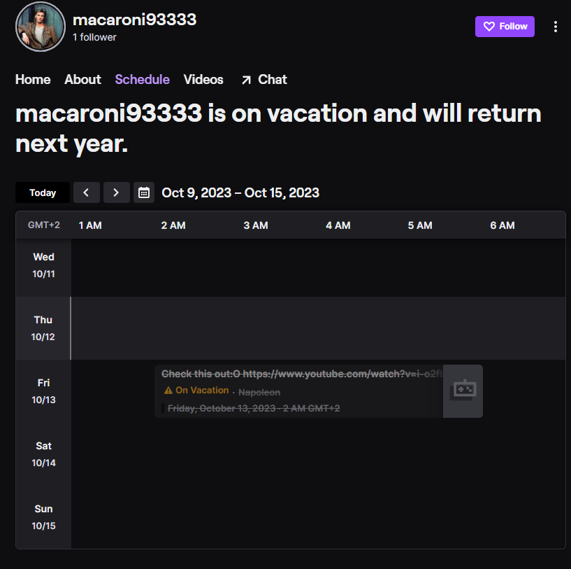

# MacGyver (🪙 908)

I recently created a profile on vimeo, but it hasn't been so popular that I had hoped for. Anyways, I would appreciate if you would check it out. Here is the link: https://vimeo.com/bWFjYXJvbmk5MzMzMw==

Oh, by the way, sometimes the URL doesn't work...

# Writeup

Url has invalid parameter, doing base64 reveals this text: 

```
macaroni93333
```

Opening https://vimeo.com/macaroni93333 we see the intro of MacGyver. Around 0:40 it mutes and some some morse code shows. Trying to decode it quickly I get `XOUTSEBE` my guess is YouTube but to be sure I go deeper and open it in Audacity to see the waveform.


```
-.-- --- ..- - ..- -... .
 Y    O   U  T  U    B  E
```

I missed a few but was on the right track. Did browse YouTube for a few hours, did not find anything. Annoyed and tired I wake up to a notification that there is an update. 

Seems like the YouTube profile was banned. He created a new prefixed with "@YT" so heading to [@YTmacaroni93333}(https://www.youtube.com/@YTmacaroni93333) I found a website with nothing on it. He has a playlist named `My Favorites` with 5 videos. Mostly manchester united, some twitch vs youtube.. `Hans Zimmer - Time` music .


I'm not a football fan, but I know that Manchester United is a football team. I also know that Hans Zimmer is a composer. But I still dont know the flag.

Checking comments for comments by this user, nothing.

Checking the times can that be a letter placement, 14:17 on the first.. letter 14 and 17?.. Nah that fails with #4. First letter in every video? 

Source code shows me some hints towards SiktCTF but no flag.

```html
<meta name="keywords" content="macaroni93333 Macaroni93333 Mac mac YTMacaroni93333 MacGyver Sikt CTF SiktCTF @macaroni93333">
<meta property="og:video:tag" content="SiktCTF">
```

After checking:

- Source code
- All comments on the favorites
- Video times e.t.c.
- Twitter, Twitch, Vimeo, Youtube I found nothing.

Asked for a tip from a friend he said that one of the videos talks about YouTube and Twitch. And my focus went back to twich which I tried a few days ago..


As you see the history shows me trying, and search shows no result. Well, I now noticed that my first attempt on the 10th of October was wrong. I tried `twitch.tv/ macaroni93333` (with a space) but the correct answer was `twitch.tv/macaroni9333`. 

Well now it went kinda fast from here, looking quickly around found his schedule interesting.



It refers to vacation `napolion` which is french. And a video showing translate the about page on your profile for YouTube. 

Clicking back to YouTube, changing my language to french and there the flag was.


Clever one! :)
# Flag

```
siktCTF{Voici_Le_Drapeau}
```