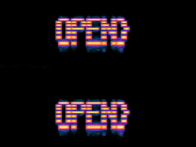

# catch em all (🪙 871)

I can't remember this version of the theme song...

📎 [pokemon.mp3](pokemon.mp3)

# Writeup

Opened in Audicity, as this was steno my first test was to look at the waveform. Bingo


And here is the whole file


Some red herrings in the file `jibberish`. But ignoring them we get a flag:




# Flag

```
siktCTF{HIDING_IN_THE_OPEN}
```