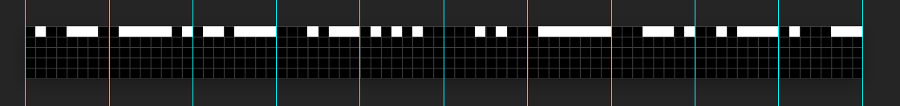

# pixel (🪙 100)

Someone have altered the Sikt logo with a green background. I wonder how they did this.

📎 [sikt.png](sikt.png)

# Writeup

Green background makes me thing about the green bitplane. I load this up in [stegonline](https://stegonline.georgeom.net/image) and browse through. I see data in more bitplanes but in Green 0 I see some dots in the top left corner. Since they hint about the green I want to research this a bit more. So I do the only thing you can do: Enhance...



Added some black to easier see all pixels below and added some lines every 8 dot. 

```
10110001 10000010 10010000 111010000 10101011 11101011 10000000 11100010 11010000 10111000
```

This translated to nothing usable. The task was 810 coins, now it is 100 coins. It is prolly a lot more simple than what I do. 

Getting pretty pissed, that I'm looking over something so obvious... It must be laughing at me, so long shot.. I send it to someone at work. Lucky me some of my colleagues loves great challenges. And a few minutes later one of them send me a flag. They just googled steganography and found [this website](https://stylesuxx.github.io/steganography/) which just found the flag. 

I'm happy for that, but annoyed that I did not find it myself. After a bit of research I see that it was Z-steg which was used. I've added that to my toolbelt for furter CTF's.

# Flag

```
siktCTF{HIDDEN_IN_THE_P1X3LS}
```
