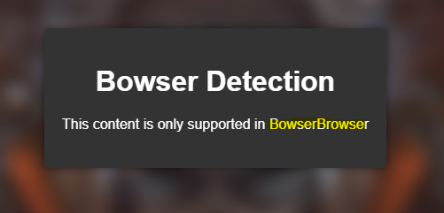
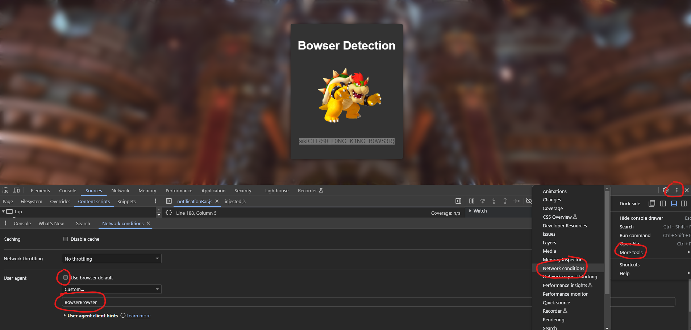

# bowser (🪙 508)

Bowser has increased the security in his castle, and has hired you to do some penetration testing. He seemes very proud of his new bowser detection, lets see if there are some holes in his security.

http://51.20.45.230:4000/

# writeup



Seems like I need to modify my user agent. A quick modification shows this:



There is the flag 

# Flag

```
siktCTF{S0_L0NG_K1NG_B0WS3R}
```

