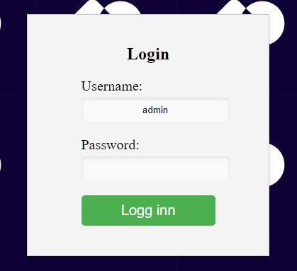
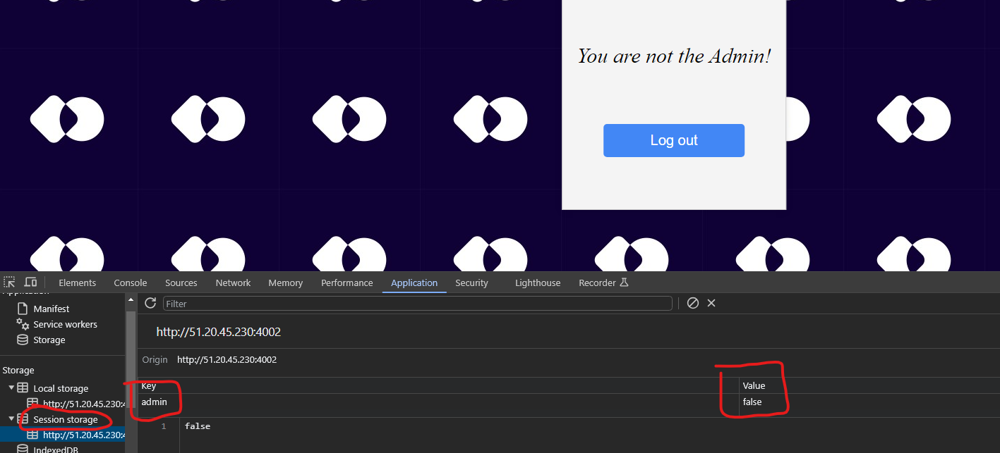
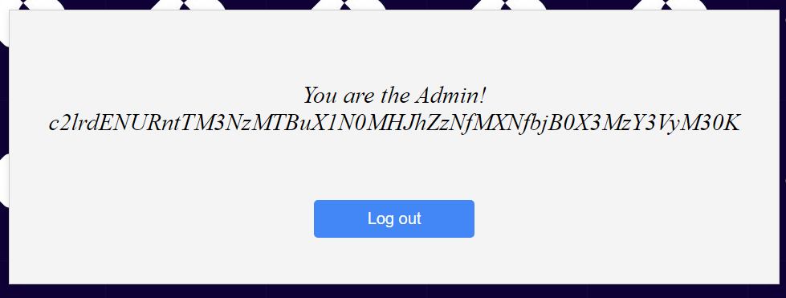
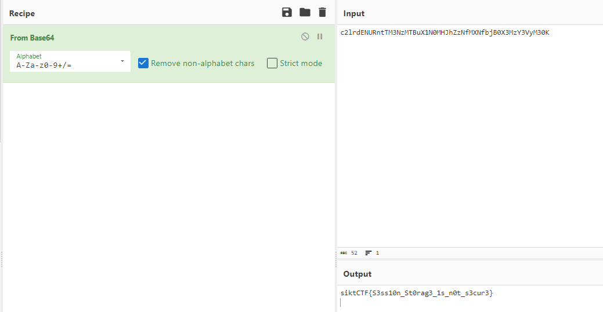

# storage (🪙 698)

I created a website a while ago, but now I have forgotten my password. Can you help me get access to the account. The username is Admin.

http://51.20.45.230:4002/

# Writeup



Opened and logged in with random user and password. Got the message that I'm not a admin.



Well the category `web`, and name `storage` made me want to look at local storage. Nothing there, lets check session storage. There it is!

Flicked the false to true and reloaded.



The string looks base64, decoding it on [cyberchef](https://gchq.github.io/CyberChef/#recipe=From_Base64('A-Za-z0-9%2B/%3D',true,false)&input=YzJscmRFTlVSbnRUTTNOek1UQnVYMU4wTUhKaFp6TmZNWE5mYmpCMFgzTXpZM1Z5TTMwSw) and there is the flag.



# Flag

```
siktCTF{S3ss10n_St0rag3_1s_n0t_s3cur3}
```