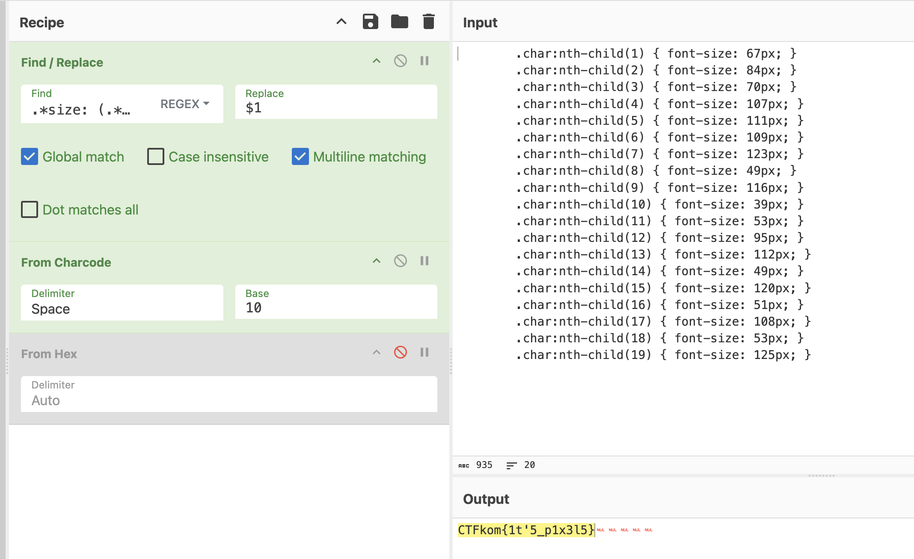

# design

yes, web design is my passion. How did you know?

https://design.telenor.live

# Writeup

In the CSS there is a given number which seems to resemble the charcodes. I copied that into [CyberChef](https://gchq.github.io/CyberChef/#recipe=Find_/_Replace(%7B'option':'Regex','string':'.*size:%20(.*?)px.*%5C%5Cn'%7D,'$1%20',true,false,true,false)From_Charcode('Space',10)From_Hex('Auto'/disabled)&input=ICAgICAgICAuY2hhcjpudGgtY2hpbGQoMSkgeyBmb250LXNpemU6IDY3cHg7IH0KICAgICAgICAuY2hhcjpudGgtY2hpbGQoMikgeyBmb250LXNpemU6IDg0cHg7IH0KICAgICAgICAuY2hhcjpudGgtY2hpbGQoMykgeyBmb250LXNpemU6IDcwcHg7IH0KICAgICAgICAuY2hhcjpudGgtY2hpbGQoNCkgeyBmb250LXNpemU6IDEwN3B4OyB9CiAgICAgICAgLmNoYXI6bnRoLWNoaWxkKDUpIHsgZm9udC1zaXplOiAxMTFweDsgfQogICAgICAgIC5jaGFyOm50aC1jaGlsZCg2KSB7IGZvbnQtc2l6ZTogMTA5cHg7IH0KICAgICAgICAuY2hhcjpudGgtY2hpbGQoNykgeyBmb250LXNpemU6IDEyM3B4OyB9CiAgICAgICAgLmNoYXI6bnRoLWNoaWxkKDgpIHsgZm9udC1zaXplOiA0OXB4OyB9CiAgICAgICAgLmNoYXI6bnRoLWNoaWxkKDkpIHsgZm9udC1zaXplOiAxMTZweDsgfQogICAgICAgIC5jaGFyOm50aC1jaGlsZCgxMCkgeyBmb250LXNpemU6IDM5cHg7IH0KICAgICAgICAuY2hhcjpudGgtY2hpbGQoMTEpIHsgZm9udC1zaXplOiA1M3B4OyB9CiAgICAgICAgLmNoYXI6bnRoLWNoaWxkKDEyKSB7IGZvbnQtc2l6ZTogOTVweDsgfQogICAgICAgIC5jaGFyOm50aC1jaGlsZCgxMykgeyBmb250LXNpemU6IDExMnB4OyB9CiAgICAgICAgLmNoYXI6bnRoLWNoaWxkKDE0KSB7IGZvbnQtc2l6ZTogNDlweDsgfQogICAgICAgIC5jaGFyOm50aC1jaGlsZCgxNSkgeyBmb250LXNpemU6IDEyMHB4OyB9CiAgICAgICAgLmNoYXI6bnRoLWNoaWxkKDE2KSB7IGZvbnQtc2l6ZTogNTFweDsgfQogICAgICAgIC5jaGFyOm50aC1jaGlsZCgxNykgeyBmb250LXNpemU6IDEwOHB4OyB9CiAgICAgICAgLmNoYXI6bnRoLWNoaWxkKDE4KSB7IGZvbnQtc2l6ZTogNTNweDsgfQogICAgICAgIC5jaGFyOm50aC1jaGlsZCgxOSkgeyBmb250LXNpemU6IDEyNXB4OyB9CiAgICA&oeol=NEL) and did some magic to get the flag

Flag format seems to be from another CTF but swapping to "telenor" did the trick.
