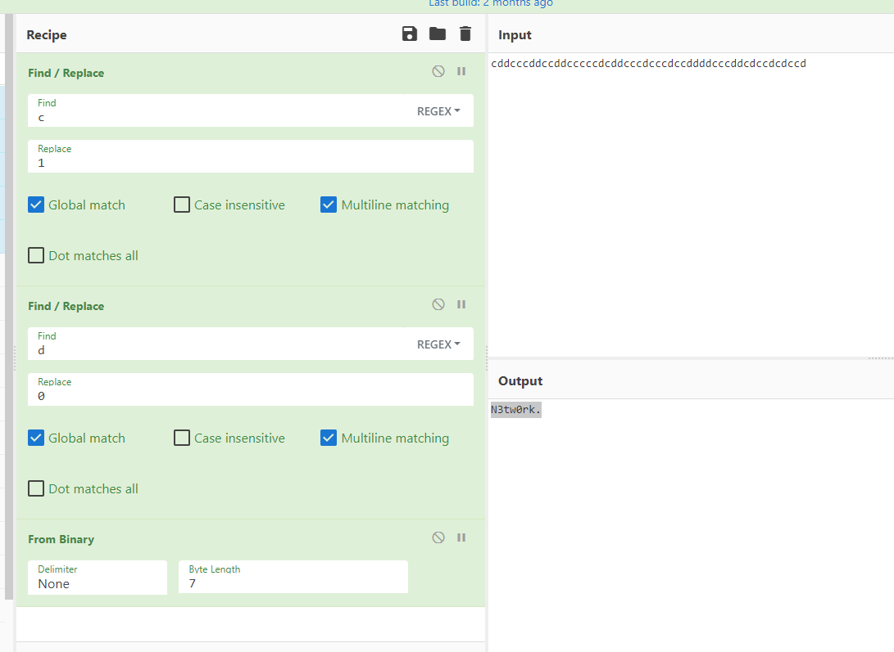

# Aww

Aww so cute, 7 types of cats and dogs, but I can't see the key. Can you help me?

The flag will be the same format as this one: UiTHack23{[a-zA-z0-9]}

# Writeup

Did not really find anything, exiftool e.t.c. Had to read hint which say dog is 0 and cat is 1 so it is binary. Quick run through the images and make a "d" for dog and "c" for cat. Then to cyberchecf.

Tried first 8 bit but did not work. So was kind of baffeled. Then I tried to adjust the bit size and a word came. So lucky guess.



So flag only contains a-z A-z and 0-9 so removing the `.` gives:

```
UiTHack23{N3tw0rk}
```