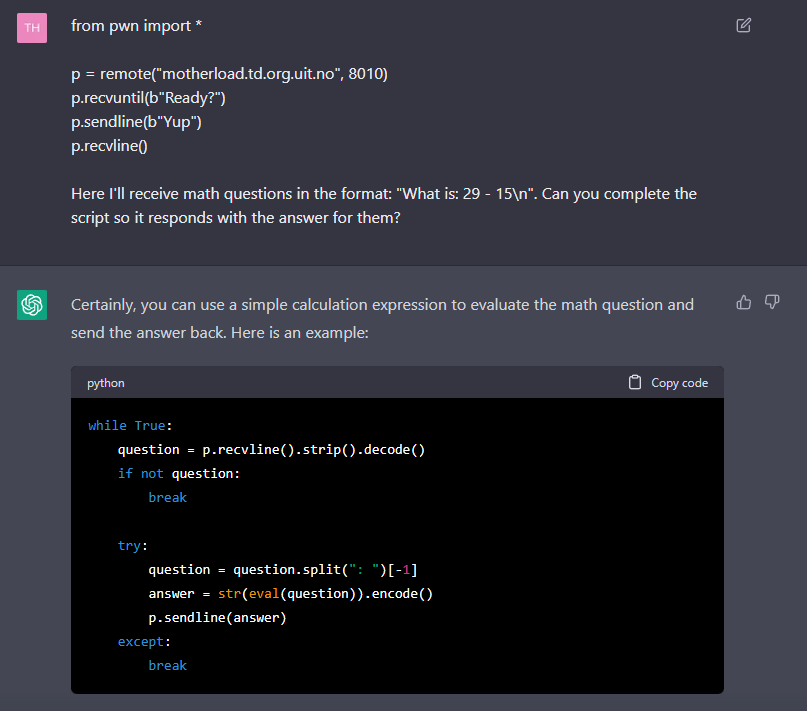

# So You Think You Can Math

Do you remember your pluses and minuses? What about your multiplications and divisions? Prove it to me by answering 300 questions correct, and I will give you a flag!

You have been given a python-script as a starting point.

motherload.td.org.uit.no:8010

# Writeup

As I'm lazy I get ChatGPT to code for me:




A bit of modifying as when doingn it manually with telnet it seems to round down and then I got a working script [examply.py](example.py).

Running it and I got this:

```
I think you can math: UiTHack23{y0u_kn0w_m4th_0r_jus7_lucky_gu3ss1ng?}
```