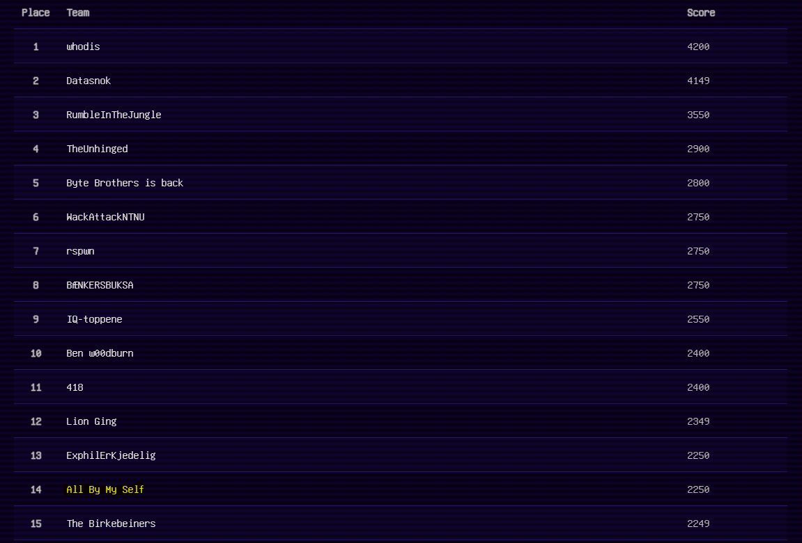

# UIT Hack 2023

I managed to get 17/31 challenges completed. Got a 14th place on my team (me alone). The CTF was up for 6 hours. I've done some after the official scoring which I've added just for fun. There were two IRL challenges which I could not travel from the south all the way north to do.

    ✅ = Completed
    🏆 = Completed during CTF (within the 6 hours)
    ❌ = Not completed

# Progress

> 23/32 completed

## PWN
- Wizardry 50p ✅ 🏆
- Ollivanders 100p ✅ 🏆
- Mp3 player 200p ✅
- Remote tamag0tchi Pet 500p ❌

## Web
- Pete's Ancient machine 100p ✅
- Popup Roulett 100p ✅ 🏆
- Bypass ??p ✅
- Nokia 3310 200p ✅ 🏆
- Flags 24/7 400p ✅

## REV_ENG
- Forrest 50p ✅ 🏆
- Fresh coffee 100p ✅ 🏆
- Pokemon Battle V2 (Aka ???) 200p ✅
- You wouldn't download a car 200p ✅ 🏆
- Pokemon Battle 400p ✅

## Crypto
- Hotel Caesar 50p ✅ 🏆
- Lion King 50p ✅ 🏆
- Code Page 100p ❌
- Kasparovs nightmare 250p ❌
- Lost my keys 350p ❌
- Oracle 400p ❌

## IRL
- Foreget stego, here you go! 100p ❌
- Can you smell that? 350p ❌

## MISC
- Guide 50p ❌
- So You Think You Can Math 100p ✅ 🏆
- Gangstas messed up paradise 150p ✅ 🏆
- Microsoft Word 1.1! 200p ❌
- Aww 350p ✅ 🏆

## NOOB
- Noob1 50p  ✅ 🏆
- Noob2 100p ✅ 🏆
- Noob3 150p ✅ 🏆
- Noob4 200p ✅ 🏆
- Noob5 250p ✅ 🏆

## ??? 
- ??? 0p (This was actually Pokemon Battle V2). Release once you did Pokemon Battle.

# Scoreboard

