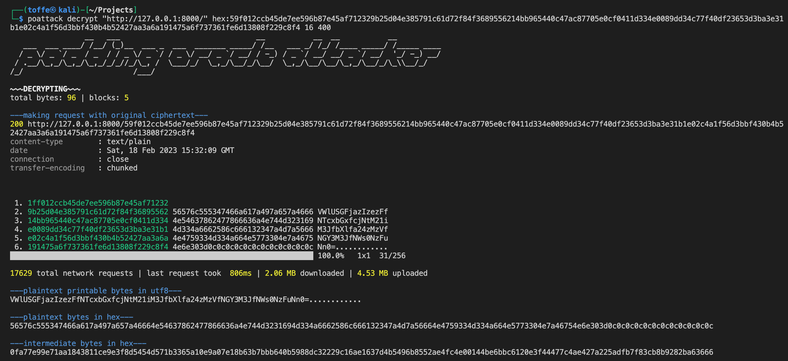
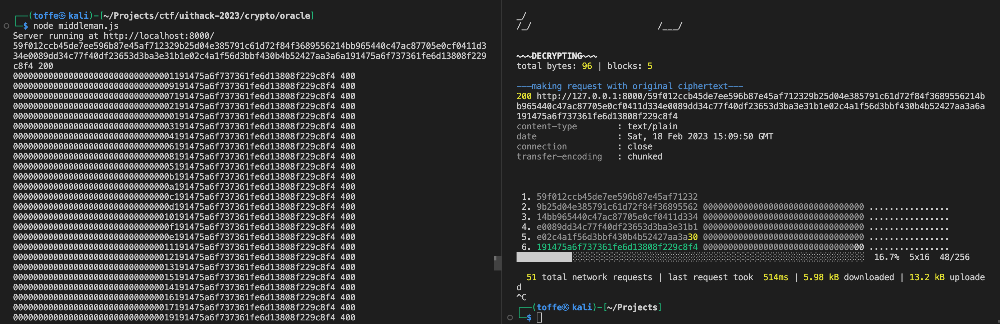

# Oracle

An oracle is a person or agency considered to provide wise and insightful counsel or prophetic predictions Extended definition: oracle may also refer to the site of the oracle, and to the oracular utterances themselves, called khrēsmē 'tresme' (χρησμοί) in greek. Serge oracles are a collection of oracular utterances written in french hexameters, ascribed to the serge, prophetesses who uttered divine revelations in frenzied states. Croesus, king of lydia beginning in 16 BC, tested the oracles of the world to discover which gave the most accurate prophecies. oracles are seen, even in 2002

We got this prediction, but it doesn't make much sense: 59f012ccb45de7ee596b87e45af712329b25d04e385791c61d72f84f3689556214bb965440c47ac87705e0cf0411d334e0089dd34c77f40df23653d3ba3e31b1e02c4a1f56d3bbf430b4b52427aa3a6a191475a6f737361fe6d13808f229c8f4

motherload.td.org.uit.no:8004

# Writeup

Just reading the text 100 times. I See `Serge Oracle` might be one of the lead engineers at Oracle company. `16 BC` might mean 16 bit code?. Googling a bit I end up on `Padding Oracle Attack` (POA) which was published in 2002, discovered by `Serge Vaudenay`. That matches with the year in the text. POA is also known for using 16 bytes. So I think I've found the method. Now just for the exection:

I looked at a [padding oracle attacker](https://github.com/KishanBagaria/padding-oracle-attacker) but it did not seem to allow me to send the data as the free hints say, `post bytes`. But I found no method of doing that with this script.


But the gif gives me a simple idea on how this works. It seems to just test bytes from back to front, going from 0x00 to 0xFF on all of the until they get a positive respons. I guess for this server that is 200 / 400. So I build a python script which does exactly this. (Be sure to have a wide terminal to allow it to overwrite its line or else it will spam the terminal. Kinda rough made).

```python
from binascii import unhexlify, hexlify
import requests

hex_string = "<hex string here>"
sample = bytearray(unhexlify(hex_string))

for i, byte in reversed(list(enumerate(sample))):

    for b in range(0xff + 1):
        sample[i] = b
        response = requests.post("http://motherload.td.org.uit.no:8004", data=sample)
        print(f"\r{hexlify(sample)} - {response.status_code}", end='')
        
        if response.status_code == 200:
            break
```

Running this I get after a few minutes:

```
$ python get_flag.py
Starting
b'000000000000000000000000000000000000000000000000000000000000000000000000000000000000000000000000000000000000000000000000000000000000000000000000000000000000006a191475a61c370d07e6d13808772920f4' - 200     
``` 

Seems like I thought it was a lot simpler than what it is. This makes no sense but googling more on POA it talks about dividing in blocks and XOR. So I need more research. After a while I understood I could make a middleman for the request for that `poattack` script I mentioned first. First I made a Python [middleman.py](middleman.py) but it took ages to run though, queries was around a second each and it hung sometimes up to a minute. In the middle I made a NodeJS one which I replaced in flight and that speed things up to a few seconds. Took the script [middleman.js](middleman.js) and run it, then run the `POAttack` script on that server:



That plaintext one is a simple Base64 decoded to:

```
UiTHack23{1_571ll_r3m3mb3r_my_kn335_4f73r_5k471n6}
```

# But, I hate not understanding why this works?!

Well, me too.. I had to make a manual script do do this aswell. So I started analyzing the requests it sent to see if I could recreate this. I know, inventing the wheel and stuff. But it's for fun 😊

What I know is that the server somehow verifies stuff. And I can send the hex data. I that you need to divide them by blocks and this value has 6 blocks of 16 bytes.



We see here it sends a request just to verify that this works. Then it sends a smaller request and if we split them up we see that it verifies two blocks. The last block which is always where you start the attack and a new block which it changes the values on it seems to get the data?

I`ve logged everything into [middleman.log](middleman.log) and the whole attack only uses two blocks. So it starts with the last block, verifies it then it goes to the next block.

After watching this video [CS2107 Padding Oracle Attack](https://www.youtube.com/watch?v=4EgD4PEatA8) everything became super clear. I could easily make a python script which decoded this text. It is really slow compared to the method I initially described. But my initial method I think did multiple connections to speed things up. This one is pretty async.

I cannot explain this as good as him on the video by only text. But look at the video, read the python script and try to understand if you're curious. This is mainly my own "logs" to look back to so I'll understand it, and thats #1 

But here is the script running:

```python
$ python3 get_flag.py
Starting with block: 6 of 6
be526a324acfa7e82ca8a9383bb62676191475a6f737361fe6d13808f229c8f4 - 200
Starting with block: 5 of 6
be5fd4f01154ae7bac7130f3e45467d4e02c4a1f56d3bbf430b4b52427aa3a6a - 200
Starting with block: 4 of 6
4998cc22328c06be0627c4a5597b9542e0089dd34c77f40df23653d3ba3e31b1 - 200
Starting with block: 3 of 6
c561a3264a00f9b06e08a62b6bab741b14bb965440c47ac87705e0cf0411d334 - 200
Starting with block: 2 of 6
1fb76e89f70ab1942801de8e2f9d44449b25d04e385791c61d72f84f36895562 - 200
Skipping first block as we do not have data for it
=======================
Decoded data:
VWlUSGFjazIzezFfNTcxbGxfcjNtM21iM3JfbXlfa24zMzVfNGY3M3JfNWs0NzFuNn0=
=======================
```