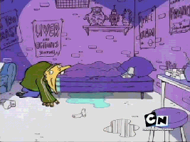

# Noob2

Reading this means you have succeded to initiate this journey to the blast. Or was it past? Idk.

Either way, the environment you have been placed within Edtropolis, the hometown of Ed, Edd and Eddy.

These goofy dudes knows the way out of Edtropolis, but will not help you until you have helped them..

Help the Ed's navigate to find what they treasure the most, JAWBREAKERS! And you shall be sent further on to escape this horrendus town of Eds.



The username for this , is noob2.
The server name is wwww.limewire.td.org.uit.no.
The password for noob2 is the last flag retrieved from noob1.


# Writeup

Ssh as noob2 into the same server and used the password from flag.txt i found on noob1

```bash
noob2@limewire:~$ ls
Edtropolis
noob2@limewire:~$ cd Edtropolis/
noob2@limewire:~/Edtropolis$ ls
eds_stash  JAWBREAKERS
noob2@limewire:~/Edtropolis$ file JAWBREAKERS 
JAWBREAKERS: ASCII text
noob2@limewire:~/Edtropolis$ cat JAWBREAKERS 
UiTHack23{We'll buy a truck-load of jawbreakers!}
noob2@limewire:~/Edtropolis$ 
```