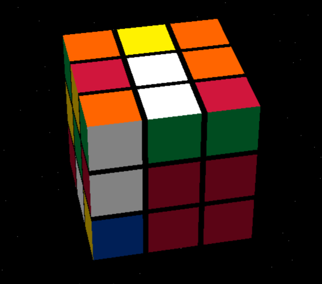
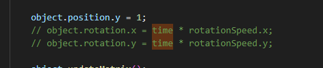
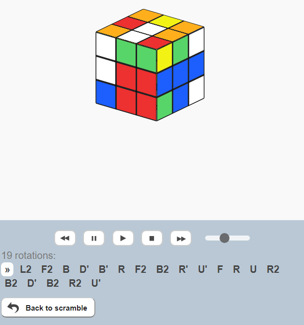

# 3D Cipher

While I was navigating through Earth's space debris on my way to the moon, I came across a fascinating discovery - a Rubik's cube floating alongside a computer. My curiosity piqued, I decided to inspect the computer, unveiling not only an encryption algorithm, but also some encrypted text! I need your help to decipher it.

https://uithack.td.org.uit.no:7000

[⬇️ 3D_cipher.zip](./3D_cipher.zip)

# Writeup

Looking at the zip file there is a `flag.txt.enc`

```
nd_0arfH0Uc}2_mr3{43T_l3h1435k1__7ih534mg!_0l3l_y37nc3
```

Analyzing it it seems to have all the right characters, and in the [3D_cipher.c](./3D_cipher.c) file it seems to be a 3D rubik's cube encryption it wants me to understand.

I see that the encrypted flag is the same size as the number of squares on a cube (6 * 9 = 54). And I tried to replace in the C code the value in the top to be the enc flag:

```c
char text[54] = "nd_0arfH0Uc}2_mr3{43T_l3h1435k1__7ih534mg!_0l3l_y37nc3";
```

But that only printed it again. So I guess I need to solve the cube with these numbers. But what is the algorithm to use? Luckily they have an unsolved cube in a 3d animation in the zip file so I can copy that into a website for solvers.



Quickly disabling the auto rotation as it was annoying as heck



 I could now easly put the colors into a [website](https://www.grubiks.com/solvers/rubiks-cube-3x3x3/) and get the solution.

 

 I got the algorithm for that. Will this work on the text above?

 ```c
L(2);
F(2);
B(1);
D(3); // 3 is thhe same as inverse, D' means basically the same as D3
B(3);
R(1);
F(2);
B(2);
R(3);
U(3);
F(1);
R(1);
U(1);
R(2);
B(2);
D(3);
B(2);
R(2);
U(3);
```

Building it with `gcc 3D_cipher.c -o 3D_cipher_mod` and running it with `./3D_cipher_mod` I got the flag:

```bash
$ ./3D_cipher_mod 
UiTHack24{7h3_m00n_15_l173r4lly_m4d3_0f_gr33n_ch3353!}
```