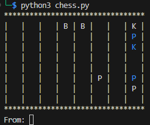

# Alien Supremacy

The aliens have composed a challenge for the petty humans using their own game against them - CHESS. Play out the sequence using the best possible moves starting as white. A chess piece move is represented by first stating where the piece moved from to where it is going.

[⬇️ alien_supremacy.zip](./alien_supremacy.zip)

# Writeup

I ran the script and got a chess board with white to move.



Set the board up on [chess-bot](https://chess-bot.com/online_calculator/next_best_move.html) and got the following moves:

```
e8h5 h6h5 h8g7 h7h6 g7f6 h5h4 f6g6
```

Manually styping the moves and finally I got the flag:

Flagg: `UiTHack24{YouAreNowGM}`

# FEN

For those interested here is the `FEN` values: 

```
FEN: 3BB2K/7p/7k/8/8/5P1p/7P/8 w - 
```


