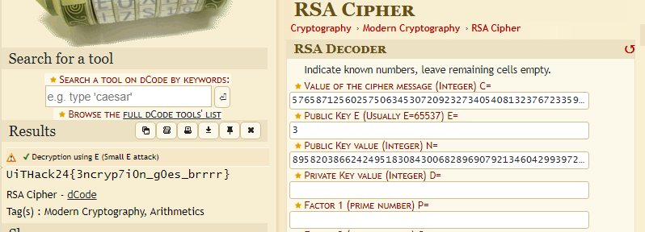

# Rapid Encryption

Those pesky aliens keep sniffing our messages and stealing our supplies! Luckily I have come up with a way to encrypt our messages so that they won't know where our supplies are located. I had to improve the encryption time of the algorithm, but I'm sure it makes no difference...

[⬇️ encrypt.py](./encrypt.py)
[⬇️ out.txt](./out.txt)

# Writeup

Seems like a weak `rsa` encryption. I used the [dCode.fr](
https://www.dcode.fr/rsa-cipher) to decrypt the message. And got the flag.



```
UiTHack24{3ncryp7i0n_g0es_brrrr}
```